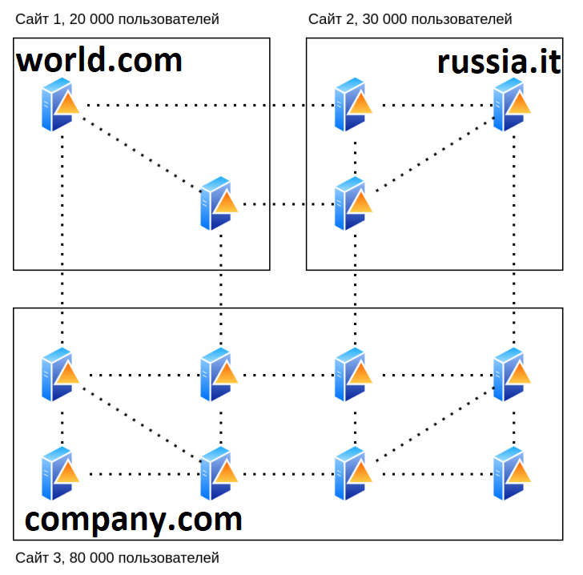
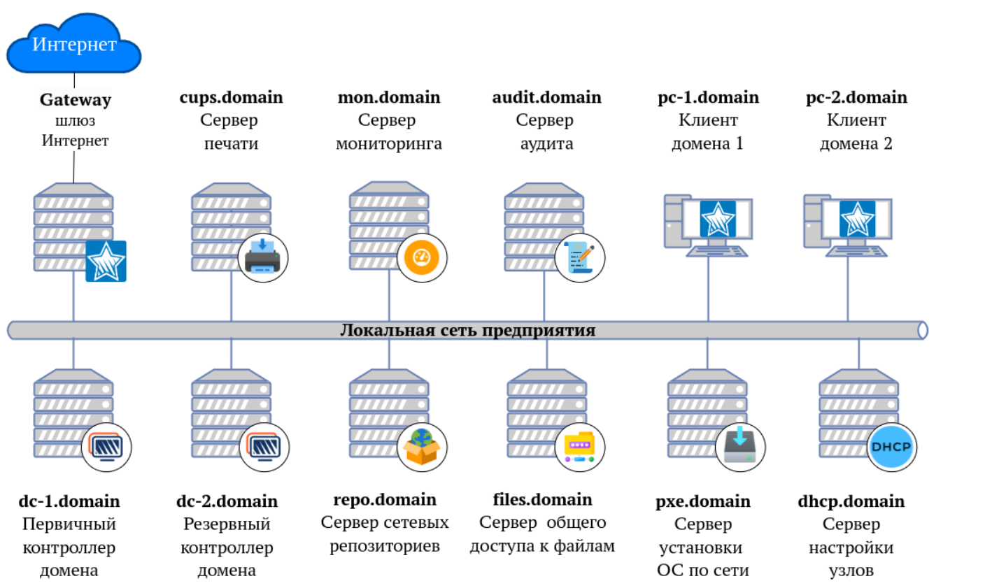

# Глава 1 "Общие сведения о ALD Pro"
Цель главы
----------
познакомиться с ALD Pro;

изучить основные компоненты программного комплекса;

получить представление об особенностях и функциональности ALD Pro.


# Для кого данная книга?

Книга предназначена для администратора, обладающего 
знаниями и опытом в следующих областях:

* Администрирование Linux основной AL-1702;

* Администрирование Linux расширенный курс AL-1703;

* Администрирование компьютерных сетей (материалы курса AL1704).

# Что такое ALD Pro? 

Процитируем текст из "Руководства администратора ALD Pro":

---------------

«ALD Pro» (Astra Linux Directory Pro) - это набор сетевых служб сервера 
Astra Linux для организации централизованного управления ИТ инфраструктурой. Система построена на хорошо известных 
компонентах с открытым исходным кодом, использующих стандартные 
протоколы обмена информацией: FreeIPA, 389 Directory Server, MIT 
Kerberos, Bind9, ISC DHCP, NTP, SSSD, CUPS, Samba, Zabbix, syslog-ng, RabbitMQ, SaltStack

---------------

В основе лежит служба каталога, которая обеспечивает 
централизованное хранение данных о пользователях, хостах, сервисных учетных записях и обеспечивает доступ к этой информации по открытым протоколам. 

Управление системой можно осуществлять из веб-интерфейса, командной строки или через REST API.


Система «ALD Pro» расширяет возможности по администрированию серверов и рабочих станций следующими функциями:

* централизованное управление учетными записями пользователей и компьютеров, организационной структурой предприятия, конфигурациями доменных компьютеров с помощью применения групповых политик, включая установку и удаление программного обеспечения;

* синхронизация времени на всех компьютерах предприятия;

* автоматизированная установка операционных систем по локальной сети;

* управление печатью и общим доступом к файлам в компьютерной сети предприятия;

* мониторинг серверной группировки и журналирование наиболее важных событий.


# Где конкретно используются тот или иной компонент ALD Pro? 

Полный программный комплекс ALD Pro состоит из нескольких компонентов: 

# Контроллер домена состоит из:

1. Собственного портала управления на базе веб-сервера Apache2;

2. FreeIPA в качестве LDAP-сервера. FreeIPA — инструмент для Linux/UNIX (аналогичный по функционалу MS Active Directory), который обеспечивает централизованное управление учетными записями и централизованную аутентификацию с помощью веб-интерфейса и командной строки;

3. 389 Directory Server. В составе ALD Pro - 389 играет роль службы каталогов LDAP, предназначенная для централизованного управления доступом к ресурсам на множестве сетевых серверов.

4. MIT Kerberos. Cлужба сетевой аутентификации по протоколу Kerberos.

---------------

## Для дальнейшего понимания теоретического материала, обсудим протокол Kerberos

Kerberos использует несколько ключевых принципов и технологий, чтобы обеспечить безопасность и удобство аутентификации:

- Криптография: Kerberos использует симметричное шифрование для защиты данных и аутентификационных сообщений. Пароли пользователей не отправляются по сети, а вместо этого используются временные билеты.

- Билеты: Когда пользователь входит в систему, Kerberos выдает ему "билет" (Ticket Granting Ticket, TGT), который служит доказательством его идентичности. Этот билет потом может быть использован для доступа к другим сервисам без повторного ввода пароля.

- Сервер аутентификации: Kerberos использует центральный сервер аутентификации (Key Distribution Center, KDC), который отвечает за выдачу билетов и управление ключами. Это позволяет централизовать аутентификацию.

- Методы временной аутентификации: Билеты имеют срок действия, что делает систему более безопасной – даже если билет будет перехвачен, злоумышленник не сможет его использовать долгое время.

- Проверка времени: В Kerberos используется синхронизация времени между клиентами и серверами, что предотвращает replay-атаки, когда старые билеты могут быть повторно использованы.

Эти механизмы в совокупности делают систему Kerberos надежной для аутентификации пользователей и защиты данных в сети.

---------------

5. Bind9. Сервер DNS работает на базе решения Bind9. 

6. NTP. Сервер  для синхронизации внутренних часов. ALD Pro использует Chronyd.

7. SSSD. System Security Services Daemon (SSSD) – это пакет приложений для управления аутентификацией и авторизацией в операционных системах на базе Linux. SSSD является отличной альтернативой Samba и Winbind, позволяя подключить Linux машину к LDAP-домену. 

8. SaltStack. SaltStack — система управления конфигурациями и удалённого выполнения операций. Является программным обеспечением с открытым исходным кодом, написанным на Python. Проект начат в 2011 году. Ныне поддерживается и развивается компанией VMware Аналог Puppet, Chef и Ansible.

9. Samba. ALD Pro использует Samba в качестве файлового сервера, для поддержки механизма контроля доступа к файлам по группам. Поддержка файловых квот.

10. RabbitMQ. Это программный брокер сообщений на основе стандарта AMQP —  связующее программное обеспечение, ориентированное на обработку сообщений. RabbitMQ нужен для решения ряда задач в системах обмена сообщениями и распределенных приложениях. По сути, он нужен для того, чтобы все компоненты ALD Pro имели общую "шину данных", для оперативного взаимодействия.


# Подсистема печати состоит из:

1. CUPS. CUPS (Common UNIX Printing System) — это система печати для UNIX-подобных операционных систем, разрабатывается компанией Apple. Задача системы обеспечить удобный единый интерфейс для управления процессом печати, организации работы принтеров и хранилище драйверов для них.

# Подсистема Общего доступа к файлам состоит из:

1. Samba. О ней уже говорили выше. 

# Подсистема Мониторинга:

1. Zabbix. Zabbix — это система мониторинга с открытым исходным кодом, предназначенная для отслеживания состояния различных компонентов IT-инфраструктуры. В ALD Pro она реализует контроль за статусом работы клиентов и серверов.

# Подсистема сбора логов:

1. syslog-ng. Гибкий системный демон для сбора, обработки и передачи логов. 


# Подсистема Репозитория ПО:

1. reprepro. Reprepro — это инструмент для управления и создания репозиториев Debian. Reprepro позволяет создавать и поддерживать локальные репозитории .deb пакетов, что упрощает процесс распространения программного обеспечения.  Поддержка шифрования и проверку подлинности пакетов с помощью ключей GPG, что обеспечивает безопасность и целостность пакетов.  Reprepro также может быть интегрирован в непрерывные процессы интеграции и развертывания для автоматизации публикации пакетов.

# Подсистема установки ОС по сети:

1. TFTP + PXE.  TFTP (Trivial File Transfer Protocol) и PXE (Preboot Execution Environment) — это технологии, которые вместе позволяют организовать загрузку и установку операционной системы Astra Linux по сети. Вот основные аспекты их работы:

* TFTP:  
- Это простой протокол передачи файлов, который обычно используется для загрузки файлов при старте устройства.
- Он работает по UDP и не поддерживает механизмы управления потоком, что делает его подходящим для использования в локальных сетях.

* PXE:  
- PXE позволяет компьютерам загружаться через сеть, вместо использования локального накопителя.
- При включении PXE-совместимого устройства оно отправляет запрос DHCP для получения IP-адреса и информации о загрузке.

* Как это работает вместе:  
- DHCP Server: Устройства, поддерживающие PXE, сначала отправляют DHCP-запрос для получения IP-адреса и информации о загрузочном сервере (например, имени файла для загрузки).
- TFTP Server: После получения этой информации устройство загружает загрузочный образ (например, kernel и initrd) с сервера TFTP.
- Загрузка ОС: Как только загрузочные файлы загружены, устройство может продолжать загрузку операционной системы по сети, используя переданные файлы.

* Применение:  
- Установка ОС на серверы и компьютеры без необходимости использования физических носителей.
- Массовое развертывание операционных систем в организациях, что экономит время и упрощает управление.

# Подсистема Динамической настройки узла. 

1. ISC DHCP. Стандартный и один из самых распространненых DHCP-серверов на Linux. Предназначен для автоматического назначения IP-адресов и других сетевых параметров клиентским устройствам в сети. 

# А что устанавливается на стороне клиентов? 

Под "стандартными" утилитами ниже по тексту имеется ввиду то, что они были взяты и адаптированы из OpenSource-проектов различных компаний, то есть не являются разработками РуБИТех, а взяты из общего программного фонда. 

1. aldpro-client — клиентская часть «ALD Pro», через которую устанавливаются и настраиваются остальные клиентские приложения и сервисы;

2. astra-freeipa-client — утилита от Astra Linux для внесения дополнительных настроек в конфигурацию sssd и других служб в соответствии с требованиями операционной системы. По факту представляет собой скрипт на Bash, который конфигурирует SSSD, Kerberos и SAMBA для работы в домене ALD Pro.

3. freeipa-client — стандартная клиентская часть подсистемы FreeIPA, настраивает службу SSSD;

4.  krb5-user — стандартная утилита для работы с Kerberos, утилиты kinit и др.;

5. sssd —  стандартный набор служб для работы машины в домене;

6.  sssd-ldap — стандартный LDAP бэкенд службы SSSD;

7. ldap-utils — стандартная утилиты ldapsearch и др. 

8. freeipa-admintools — стандартный набор утилит администрирования ipa CLI;

9. salt-minion — клиентская системы централизованного администрирования SaltStack, стандартная утилита Salt;

10. zabbix-agent — клиентская часть подсистемы мониторинга, стандартный агент для Zabbix;

11. syslog-ng — клиентская часть подсистемы журналирования, стандартная утилита Linux.

# Какие минимальные характеристики для программного комплекса ALD Pro? 

| Компонент | CPU Ядер | RAM | SSD | Кол-во развернутых серверов (минимум)
| ---------| -------- | --- | --- |  ---------------------------
| Контроллер домена на 3000 пользователей, при эксплуатации механизма групповых политик SaltStack | 8 | 16 Гб | >=50Гб | 2 шт. 
| На каждую следующую 10000 пользователей  | 10 | +1 Гб  | +300Мб | 
| Подсистема Мониторинга  | 2 | 2 Гб | >=30 Гб | 1 шт.
| Подсистема DHCP  | 2 | 2 Гб | >=30 Гб | 1 шт.
| Подсистема Репозитория ПО  | 2 | 2 Гб | >=100 Гб | 1 шт.
| Подсистема Установка ОС (PXE+TFTP)  | 2 | 2 Гб | >=30 Гб | 1 шт.
| Подсистема Служба печати  | 2 | 2 Гб | >=30 Гб | 1 шт.
| Подсистема Файловый сервер  | 2 | 2 Гб | >=30 Гб | 1 шт.


При этом, крайне не рекомендуется на одном сервере выполнять развертку более чем одной подсистемы. Рассчитывайте мощности по формуле:

```
1 подсистема = 1 сервер
```

Надежность всей ИТ инфраструктуры напрямую связана с работой доменных служб, поэтому администраторы должны тщательно подходить к планированию домена и использовать различные методы вертикального и горизонтального масштабирования, чтобы избежать проблем с производительностью. 

Разберем основные советы по масштабированию. 

## Вертикальное масштабирование

Вертикальное масштабированием называют повышение производительности системы за счет повышения производительности отдельного узла путем выделения серверу дополнительных вычислительных ресурсов - оперативной памяти, потоков центрального процессора и т.п. То есть,  в этом случае система получает приток новых вычислительных ресурсов за счет повышения мощностей на сервере. 

Сразу укажем, что такое горизонтальное масштабирование 

## Горизонтальное масштабирование 

Горизонтальное масштабирование — это стратегия расширения вычислительных мощностей системы путем добавления дополнительных узлов (серверов или машин) к существующей инфраструктуре, вместо увеличения ресурсов на уже существующих узлах. 

Ключевые моменты:

- Добавление узлов: Вместо того чтобы увеличивать производительность одного сервера (вертикальное масштабирование), вы добавляете больше серверов в кластер.

- Распределение нагрузки: При горизонтальном масштабировании нагрузка распределяется между несколькими серверами, что помогает избежать узких мест и обеспечивает более высокую доступность.

- Масштабируемость: Этот подход позволяет системе легко адаптироваться к увеличению нагрузки за счет увеличения числа узлов.

- Отказоустойчивость: Если один из узлов выходит из строя, остальные продолжают работать, что повышает общую надежность системы.

- Сложность управления: Необходимость управления несколькими узлами может увеличить сложность архитектуры и процессов.

# Как запланировать ресурсы на ALD Pro заранее? 

Попытаемся предугадать потенциальные нагрузку на вашу инфраструктуру, чтобы удачно внедрить ALD Pro и не попасть в беду при внедрении в инфраструктуру.


## Объем HDD 

При выборе сервера помните, что в работе службы каталогов преобладают операции чтения, поэтому ключевую роль играет объем доступной оперативной памяти, чтобы контроллер мог обрабатывать запросы без обращения к медленным дискам сервера.

Файлы каталога расположены в папке /var/lib/dirsrv, после развертывания первого контроллера размер базы составляет порядка 45 Мб и увеличивается по мере создания объектов (добавления пользователей и компьютеров).  
В среднем, по 30 Кб на каждый объект. 

Таким образом, размер файлов на диске можно рассчитать математически: для нужд самой операционной системы контроллеру следует выделить порядка 30 ГБ, а под хранение каталога для упрощения расчетов возьмем по 1ГБ на каждые 35 тысяч объектов. Формула получается такой:

```
HDD, Гб = 30 + N объектов \ 35 000
```

В целом, для инфраструктуры даже в 1000 пользователей объема диска в 50 ГБ должно хватить. 

Для высокой скорости записи используйте SSD накопители или быстрые RAID массивы.

## Объем оперативной памяти

Для загрузки каталога требуется больше оперативной памяти, чем на диске, т.к. служба ns-slapd индексирует данные каталога. Пустая база данных занимает в памяти порядка 65 Мб и это значение растет по мере увеличения числа объектов, в среднем по 50 Кб на каждую дополнительную учетную запись.  Таким образом, минимально необходимый объем оперативной памяти можно рассчитать математически: для самой ОС нужно минимум 3 Гб ОЗУ, а для работы с каталогом в целях упрощения расчетов возьмем по 1ГБ на каждые 10 тысяч объектов:

```
ОЗУ, ГБ = 3 + N объектов \ 10 000
```

Проведем такой расчет, для инфраструктуры с 10 000 объектами (компьютеры + пользователи + группы), получается что только под задачи работы одной системы SLAPD, нужно: 

```
ОЗУ, ГБ = 3 + 10 100 объектов / 10 000 ~ 4 Гб ОЗУ
```

А если инфраструктура будет больше, например, на 130 000 объектов, контроллеру нужно выделить до:

```
ОЗУ, ГБ = 3 + 130 000 объектов / 10 000 ~ 16 Гб ОЗУ
```

Важно уточнить, получается что 16 Гб из расчета выше это исключительно для работы подсистемы ns-slapd, а ведь операционная система выполняет еще ряд работ и задач, так что смело значение увеличивать на +40%.


## Количество потоков центрального процессора

Количество ресурсов центрального процессора определяется тем, сколько пользователей будут обслуживать конкретный контроллер. Рекомендуется рассчитывать из формулы - 1 тысяча пользователей на 1 поток центрального процессора. При использовании механизма групповых политик SaltStack значение необходимо увеличить вдвое. 
Для расчета, можно взять формулу: 

```
ЦПУ Потоков = (1 + N пользователей) \ 1000
```

## Пропускная способность сети клиентов

При планировании домена следует учитывать два основных вида трафика, который генерируется ALD Pro:

1. Трафик клиентских запросов (Kerberos и LDAP запросы к каталогу)

2. Трафик репликации (по стандартному LDAPS протоколу)

На доменных контроллерах преобладает исходящий трафик, так как клиенты генерируют входящие небольшие запросы, напротив на запрос большого количества данных от контроллеров. 

Безусловно, оценки пропускной способности являются довольно субъективными, но стоит учитытвать, что для 5 000 пользователей будет достаточно 100 Мбит\сек для комфортной работы. В результате оптимизации сетевого взаимодействия стоит прийти к тому, чтобы предел не превышал 40% от максимума в пиковые нагрузки. 

Учитывая, что внешние каналы связи редко достигают гигабитных скоростей и активно используются пользователями для выхода в Интернет, в каждой точке потребления следует размести локальную реплику сервера для запросов в этой подсети. В этом случае, VPN-туннели, которые связывают децентрализованные офисы будут использоватся только для репликации данных между доменами. Клиентский трафик останется в пределах офисной сети.

## Пропускная способность сети серверов 

В ходе работы серверов, самый большой трафик генерируемый хостами будет на моменте репликации. Стоит обеспечить доступность серверов пропускной способностью, как минимум, в 10-20 Мбит\сек.


## Как много всего пришлось считать, так ведь и легко запутаться!

Действительно, этап планирования получается довольно хлопотным, давайте в рамках практической работы проведем несколько вычислений, чтобы на реальном примере проверить, как это все работает и считается в рамках реального ТЗ. 

Итак, проведем полный анализ конфигурации серверов для инфраструктуры масштабом в 30 тысяч человек. 

### Расчеты объема жесткого диска

```
HDD = 30 + 30 000 / 35 000 ~ 1 Гб
```

Далее возъмем минимум 30 ГБ на операционную систему, а также добавим минимально рекомендуемые +40% Гб от минимального необходимого комплекта (в 31 Гб).

Выходит, что для одного сервера желательно запланировать объем постоянного хранилища в 120 Гб. Этого значения точно хватит с существенным запасом на будущие проекты расширения и улучшения инфраструктуры. 

### Расчеты объемов оперативной памяти

```
ОЗУ = 3 + 30 000 / 10 000 ~ 3 Гб 
```

Получается, что минимум для работы только службы NS-SLAPD потребуется 3 Гб ОЗУ. Также стоит добавить + 3 Гб на нужды самой ОС. И также +40% запасного значения. В итоге получаем, около 18 Гб ОЗУ . Этого значения будет хватать для комфортного функционирования инфраструктуры. 

### Расчеты количества потоков процессора

```
ЦПУ = (1 + 30 000 ) \ 1000 ~ 30 потоков. 
```

Значения в 30 потоков достаточно для работы на одном сервере. Этого значения будет хватать для комфортного функционирования инфраструктуры. 


### Пропускная способность сети 

Для комфортной работы 5 000 пользователей необходимо 100 Мбит\Сек.

Получается, для 30 000 потребуется минимум 600 Мбит\Сек.

### Итог расчетов

Если планируется, что даже при развертывании двух контроллеров домена нагрузка на каждый будет около 30 000 пользователей, оптимальные технические характеристики каждого будут: 

SSD = 120 ГБ

RAM = 18 ГБ ОЗУ

CPU = 30 Cores

Network = 1 Гб\сек


# Но это очень много! 

Конечно, поэтому лучшим решением будет выполнять репликацию и распределение нагрузки. 

В этом случае можно существенно сократить затраты на одном сервере.

Например, при инфраструктуре в 30 000 пользователей, рационально будет развернуть минимум 3 доменных контроллера, чтобы получить среднюю нагрузку на каждый контроллер в 10 тысяч пользователей. Тогда ресурсы на каждый сервер будут:

HDD = 60 Гб

RAM = 8 Гб ОЗУ

CPU = 8 Cores

Network = 1 Гб\Сек (или как минимум 200 Мб\сек)

Количество серверов для репликации ничем не ограничено, главное учитывать, что чем больше инфраструктура, тем сложнее будет её администрировать и ожидать репликации среди всех контроллеров. В среднем, время репликации зависит, в основном, от пропускной способности между контроллерами. 

Так, например,  при массовой миграции 1000 пользователей сгенерируется трафик объемом около 1 Гб. Соотвественно, при скорости в 100 Мб\сек между контроллерами домена, потребуется всего 10 секунд для репликации.

Но сильные нагрузки происходят только при создания новых данных или изменениях старых, так что нагрузку вполне реально спрогнозировать заранее.


# Топология контроллеров домена

Топологией, в контексте нашей темы, мы считаем взаимосвязь всех контроллеров между собой, в рамках одной организации. 

Для понимания дальнейшей терминологии. Обсудим:

1.  Домен ALD Pro — это группа компьютеров, совместно использующих общую базу данных. Имена доменов ALD Pro должны быть уникальными.

Например, домен  - example.com. А компьютер в нем, имеет имя - pc1.example.com. 

2. Сайт (site) — подсеть или область данных. Сайт используется для настройки доступа к каталогу  и для репликациию. Например, при создании одного сервера в домене example.com вы получили сайт. 

Добавить компьютер в домен, значит что вы добавили его в сайт. 

Получается, что топология состоит из сайтов. Когда говорят о сайтах, обычно клиентские компьютеры не учитывают. Только сервера репликации. 



Вот, например, топология между тремя различными сайтами. Между сайтами реализовано доверие, для того чтобы обеспечить связность между разными компаниями. 

А внутри сайта сделана репликация между двумя, тремя и более контроллерами. 

Для обеспечения надежности инфраструктуры необходимо установить как минимум два доменных контроллера в рамках одного сайта. 

В таком случае, надежность может быть практически 99%.

Максимальное количество контроллеров домена, которые одновременно может быть использовано рабочей станцией ограничено 3-емя. Так как Linux поддерживает одновременную работу только с 3 DNS-серверами. 

Соответственно остальные контроллеры необходимо либо резервировать через VRRP протокол, или использовать другие контроллеры домена исключительно как репликацию (буквально бекап).

## Хочу сделать 100 репликаций, это значит я получу идеальную и безопасную инфраструктуру? 

Не совсем так, конечно, не рекомендуется создавать более 4 реплик, ведь при повышении этого количества вы перестаёте выигрывать в надежности, но при этом время на реплику будет только увеличиваться и усложняться. 

Контроллер не принимает запросы на изменение от нескольких реплик одновременно, а значит что в один момент работает только отношение между серверами A и B (условно), а остальные C и D простаивают.

Создавать много реплик актуально, если каждая реплика находится в непосредственной близости с потребителями ресурсов. 

# Хорошо, с контроллерами вроде разобрались, а как выглядит другая инфраструктура? 

Получается, что по итогу типовая инфраструктура ALD Pro, при условии полной реализации всех возможностей программного комплекса выглядит вот так.



Для них не требуется проводить такую сложную математику и расчеты, так как они меньше генерируют трафика и взаимодействия. Так что для удобства планирования, используйте таблицу выше по тексту. 

# Вот мы провели большую работу, распланировали инфраструктуру, посчитали нагрузку и топологию.

**Что же мы забыли?** 

Самое главное - имя! 

Наверняка многие из вас читали документацию на Windows Active Directory и встречали домены - **contoso.com** или **example.com**. Такие названия, конечно, неуместно использовать в реальной инфраструктуре. 

Разработчиками ALD Pro предлагается использовать домен компании третьего уровня. Например, если организация купила домен - **mylittlecompany.ru**, то желательно в иитоге домен получить - **ald.mylittlecompany.ru**. 

Таким образом будет гарантироваться отсутсвие конфликтов с публичными DNS именами. 


Также, ни в коем случае нельзя использовать зоны **.lan**, **.internal**, **.local**. Использовать **.local** нельзя, так как в Linux используются протокол zerconf, который реализован в Linux службой Avahi. 


---------------

Zeroconf, также известный как Zero Configuration Networking, – это набор технологий, позволяющий устройствам автоматически обнаруживать друг друга и настраивать сети без необходимости ручной конфигурации.

Основные компоненты Zeroconf:

- Автоматическое присвоение IP-адресов: Устройства могут назначать себе IP-адреса из специального диапазона, если DHCP-сервер недоступен.
  
- Обнаружение сервисов: Устройства могут находить и взаимодействовать с другими устройствами и их сервисами в локальной сети без необходимости жесткой конфигурации. Это достигается с помощью таких протоколов, как Multicast DNS (mDNS) и Service Discovery (DNS-SD).

- Автоматическая конфигурация: Устройства могут обмениваться конфигурационной информацией на основе протокола, чтобы упростить подключение и использование.

Применение: Zeroconf широко используется в локальных сетях для подключения мультимедийных устройств, принтеров, компьютеров и других устройств без дальнейших настроек.

---------------


## С доменной зоной определились, а какой выбрать префикс? 

Выбор префикса для домена: 

- Следует выбирать префикс, который не был привязан к операционной системе или продукту компании. Например, универсальные слова - **corp**, **office**, **ent**. 

- Следует выбирать префикс, содержащий только стандартные символы и числа. Но полностью числовые префиксы недопустимы. 

- Длина префикса + домена не превышает 15 символов.

- При выборе префикса следует учитывать, что два домена не смогут работать в доверительных отношениях, если у них будут совпадать NetBIOS-имена и имена контроллеров домена,например, если текущий домен AD DS имеет имя corp.mycompany.com, то не стоит для домена «ALD Pro» использовать имя corp.mycompany.ru. Иначе не получится создать между этими доменами доверительные отношения.

- В ALD Pro (как и в FreeIPA) нельзя использовать большие буквы в названии домена, серверов и клиентов в нём. 


## На этом вводный урок закончится, дальше обсудим развертывание доменного контроллера.

# Дополнительная информация:
1) ALD Pro: Официальный сайт проекта  [Ссылка](https://www.aldpro.ru/)
2) Ald Pro: Видео по развертыванию доменного контроллера от канала ИТ-проповедник [Ссылка](https://www.youtube.com/watch?v=oLJ_p8J-OkA)
3) Ald Pro: Сайт сообщества ALD Pro [Ссылка](https://ald-pro.com/)
4) ALD Pro: Сообщество администраторов в Telgramm [Ссылка](https://t.me/aldpro_consulting)
5) Документация проекта ALD Pro [Ссылка](https://www.aldpro.ru/docs/)