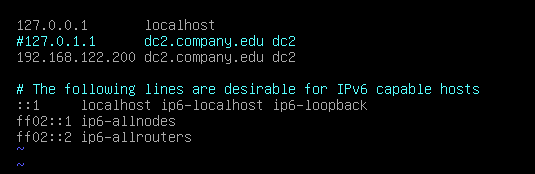
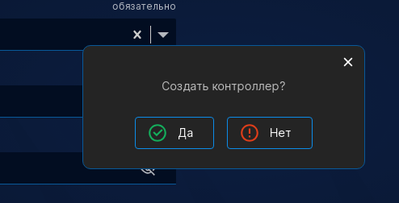
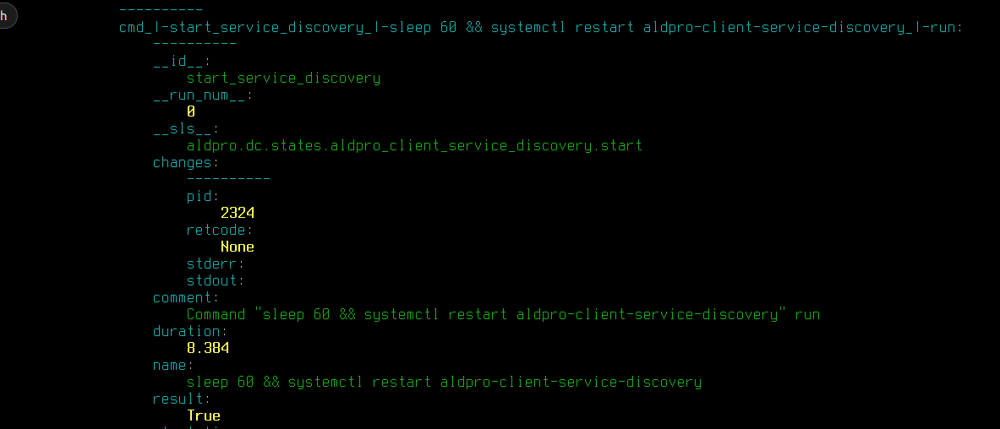

# Глава 2 "Развертывание программного комплекса ALD Pro - серверная часть."
Цель главы
----------

изучить методы развертывания программного комплекса ALD Pro;

получить представление о этапах установки и внедрения ALD Pro.


# Подготовка сервера к установке контроллера домена

На момент создания статьи (07.08.2024) актуальной версией ALD Pro является 2.3.0. Поддерживается совместимость с версией ОС Astra Linux от 1.7.4 до 1.7.5.16.

На контроллерах домена обязательно установлен режим защищенности "Максимальный" ("Смоленск"). Для рабочих станций можно использовать любой уровень защищенности. Для проверки версии и уровня защищенности используйте команды: 

```
cat /etc/astra/build_version
sudo astra-modeswitch getname
```


Также настоятельно рекомендуется развернуть сервер без графического интерфейса, только консольный режим. 
В случае, если сервер был установлен с графическим интерфейсом fly-wm, то тогда в качестве основного инструмента управления сетью является NetworkManager.

Его нерекомендуется использовать на инфраструктурных серверах программного комплекса ALD Pro, поэтому в первую очередь его нужно выключить:

```
sudo systemctl stop NetworkManager
sudo systemctl disable NetworkManager
sudo systemctl mask NetworkManager
sudo systemctl status NetworkManager
```

Последовательный ввод команд выше приведет к отключению NetworkManager.

```
NetworkManager.service
 Loaded: masked (Reason: Unit NetworkManager.service is masked.)
 Active: inactive (dead) since Tue 2024-08-07 11:44:21 MSK; 5min 21s ago
 Main PID: 493 (code=exited, status=0/SUCCESS)
```

В случае, если используется версия Astra Linux SE 1.7.4 команды будут следующие:

```
sudo systemctl stop network-manager
sudo systemctl disable network-manager
sudo systemctl mask network-manager
sudo systemctl status network-manager
```

После отключения NetworkManager основным инструментом управления сетью должен стать конфигуационный файл - **/etc/network/interfaces**

Безусловно, для инфраструктурных серверов настоятельно рекомендуется устанавливать статический IP-адрес, перейдем к настройке

## Настройка сетевых реквизитов

Для того, чтобы выполнить настройку необходимо перейти в файл **/etc/network/interfaces** с помощью любого текстового редактора и привести его к следующему виду:


**Что мы тут такого написали?**

**auto eth0** - указывает, что интерфейс eth0 добавлен в автозагрузку и при включении компьютера он автоматически будет настроен в соотвествии с описанием конфигурационного файла. 

**allow-hotplug eth0**  - автоматически выполнять перезапуск интерфейса при его внезапном отключении

**iface eth0 inet static** - статическая настройка сетевого интерфейса. Допускается использование inet6 (для IPv6 адресации). Следующее значение указывает на **static** или **dhcp** для настройки способа получения адреса динамически или статически. 

**address 192.168.122.100/24** - устанавливаемый адрес и маска подсети

**gateway 192.168.122.1** - шлюз по умолчанию для устройства

Откуда взялось имя eth0? 

Вывод команды **ip a** 


Старое название интерфейсов - eth0; eth1; eth2 на данный момент чаще всего встречается в виртуальной инфраструктуре, на физических современных серверах такое именование встречается реже. В современных Linux-системах с 2014 года используются следующие варианты схем наименования сетевого интерфейса, в порядке применения:

1. Имя, предоставляемое аппаратным обеспечением (Firmware или BIOS), включающее порядковый номер, для устройств, расположенных на материнской плате, к примеру eno1. Если выбор имени не произведен, используется способ п. 2.

2. Имя, предоставляемое аппаратным обеспечением (Firmware или BIOS), включающее порядковый номер слота PCI Express, к примеру ens1. Если выбор не произведен, используется способ п. 3.

3. Имя формируется из физического положения точки подключения устройства, к примеру enp2s0. Иначе используется способ п. 5.

4. Имя включает MAC устройства, к примеру enx94de80a44f0c. Эта схема по умолчанию не используется.

5. Старая схема, где имя присваивается ядром в порядке обнаружения интерфейса, к примеру eth0 и т.д. Это поведение по умолчанию.

Новые имена сами по себе содержат полезную информацию. Принятое соглашение о наименовании следующее: первые два символа отражают тип интерфейса:

* en — Ethernet.

* wl — беспроводная локальная сеть, WLAN.

* ww — беспроводная глобальная сеть, WWAN.

Далее следует тип, отражающий схему наименования:

* o<index> — индекс для устройств расположенных на материнской плате.

* s<slot>[f<function>][d<dev_id>] — сначала идет номер PCI Express слота, далее f<function> - номер функции у многофункционального PCI устройства, и последним идет идентификатор устройства.

* p<bus>s<slot>[f<function>][d<dev_id>] — расположение устройства на PCI шине. Домен PCI (p<bus>) указывается только если он отличен от нулевого. Номер функции и номер устройства аналогично предыдущему примеру.

* p<bus>s<slot>[f<function>][u<port>][..][c<config>][i<interface>] — расположение устройства на USB шине, причем учитывается вся цепочка портов.

* x<MAC> — MAC адрес.

Нужно отметить, что имя не может быть более 15 символов, это ограничение ядра.


### Как применить настройки из файла? 

Выполнить перезагрузку службы - networking

```
systemctl restart networking
```

После выполнения команды выше, при условии если не было ошибок, следует ввести следующую команду:

```
systemctl status networking
```

Команда должна вернуть успешный запуск слжубы networking. 

А затем, с помощью уже известной команды **ip a** убедимся в том, что все сработает. Весь перечень команд, которые были введены для настройки представлены также на скриншоте в порядке выполнения:


### Основные ошибки

Данная настройка легкая и ошибок тут практически не может быть, основные сложности - опечатки и логические ошибки. При настройке будьте внимательны в вводе имени, адресации и маски подсети. 

Перед настройкой убедитесь, что вы правильно выбрали интерфейс и не ошиблись с его наименованием. 


## Для работы также потребуется указать DNS-сервера, которые сервер будет использовать для обращения к репозиториям общедоступным или внутренним.

Указать их можно в текстовом файле - **/etc/resolv.conf**

```
nameserver 192.168.122.1
```


## Имя сервера

Имя сервера должно быть задано в формате полного имени хоста FQDN, например, dc1.company.edu. Где company.edu - это название домена предприятия. Такой подход используется во FreeIPA и был также наследован в ALD Pro.

Настроить имя можно с помощью простой команды:

```
sudo hostnamectl set-hostname dc1.company.edu
```


В этом случае правки будут внесены в **/etc/hostname**, при желании, вы можете напрямую вносить корректировки в этом файле с помощью любого текстового редактора. 

Для того, чтобы имя контроллера всегда могло быть преобразовано в IP-адрес, даже при недоступности DNS-сервера, в файл /etc/hosts требуется добавить строку, соответствующего его FQDN. В эту строку настоятельно рекомендуется вписать не только полное, но короткое имя хоста, первым по списку обязательно должно идти полное имя хоста, т.к. первое имя считается приоритетным и будет возвращаться командой **hostname -f**, что критически важно для работы внутренних скриптов ALD Pro и FreeIPA.

Соответственно, обязательно убедитесь, что команда **hostname -f** возвращает полное имя


Все имена в инфраструктуре (как серверные, так и клиентские хосты) обязаны быть в нижнем регистре! 

По итогу, файл **/etc/hosts** обязательно должен иметь следующий формат. При использовании в своей инфраструктуре, конечно же, укажите собственные IP-адреса и имена серверов. 


## Установка ПО и подключение репозиториев.

Репозиторий пакетов - это централизованное хранилище для программных пакетов, часто используемых в операционных системах и системах управления пакетами. Основные функции такого репозитория включают:

- Хранение программных пакетов, таких как приложения, библиотеки и утилиты.
- Распределение программного обеспечения, позволяя пользователям легко устанавливать, обновлять и удалять пакеты через систему управления пакетами.
- Обеспечение зависимости, автоматически устанавливая необходимые зависимости для корректной работы пакета.
- Обновление пакетов, предоставляя последние версии программного обеспечения с исправлениями и новыми функциями.

Примеры репозиториев пакетов и соответствующих систем управления пакетами:

- APT (Advanced Package Tool) - используется в Debian и Ubuntu для управления .deb пакетами.
- YUM (Yellowdog Updater, Modified) и DNF (Dandified YUM) - используются в Red Hat, CentOS и Fedora для управления .rpm пакетами.
- PyPI (Python Package Index) - используется для пакетов Python и управляется через pip.

### Для Astra Linux также есть интернет-репозитории

И настроить их легко можно в файле **/etc/apt/sources.list**, или также дополнительные списки в **/etc/apt/sources.list.d**.

Рекомендуется использовать интернет-репозитории Astra Linux или, при условии, если в вашей организации выход в интернет ограничен - создать локальное зеркало репозиториев Astra Linux через утилиту apt-mirror. Использование установочных дисков допустимо, но неудобно использовать если серверов много, а также тяжело контроллировать их актуальность и исправления. 

* Настройка использования интернет-репозитория Astra Linux 1.7.4

Для установки на сервере под управлением Astra Linux SE 1.7.4.X ALD Pro версии "2.3.0" из официальных интернет-репозиториев РБТ-Астра. Содержание файла **/etc/apt/sources.list** должно быть следующим:

```
deb http://dl.astralinux.ru/astra/frozen/1.7_x86-64/1.7.4/repository-main 1.7_x86-64 main non-free contrib
deb http://dl.astralinux.ru/astra/frozen/1.7_x86-64/1.7.4/repository-update 1.7_x86-64 main contrib non-free
```

Также, допускается добавить следующие репозитории:

```
deb http://dl.astralinux.ru/astra/frozen/1.7_x86-64/1.7.4/repository-base 1.7_x86-64 main non-free contrib
deb http://dl.astralinux.ru/astra/frozen/1.7_x86-64/1.7.4/repository-extended 1.7_x86-64 main contrib non-free
```

Для установки на сервере под управлением Astra Linux SE 1.7.5 ALD Pro версии "2.3.0" из официальных интернет-репозиториев РБТ-Астра. Содержание файла **/etc/apt/sources.list** должно быть следующим:

```
deb http://dl.astralinux.ru/astra/frozen/1.7_x86-64/1.7.5/repository-main 1.7_x86-64 main non-free contrib
deb http://dl.astralinux.ru/astra/frozen/1.7_x86-64/1.7.5/repository-update 1.7_x86-64 main contrib non-free
deb http://dl.astralinux.ru/astra/frozen/1.7_x86-64/1.7.5/repository-base 1.7_x86-64 main non-free contrib
deb http://dl.astralinux.ru/astra/frozen/1.7_x86-64/1.7.5/repository-extended 1.7_x86-64 main contrib non-free
```

Наверняка, вы ранее использовали stable ветку для решения большинства своих рабочих задач. Для развертывания ALD Pro нерекомендуется торопится и использовать stable версию, в силу того, что программный комплекс ALD Pro очень зависим от версионности программ внутри. А stable, конечно же, обновляется и актуализируется. 

Так что используем только frozen - для стабильной работы системы. 

* Настройка использования интернет-репозитория ALD Pro

Создадим отдельный файл для ALD Pro. Это не повлияет на его приоритетность, но предоставит некоторый порядок и понимание подключенной структуры.

```
sudo nano /etc/apt/sources.list.d/aldpro.list
```

Файл создать новый, и наполнить его строкой:

```
deb https://dl.astralinux.ru/aldpro/frozen/01/2.3.0 1.7_x86-64 main base
```

Для понимания вписанной строки, давайте проведем её декодинг:

* deb — указывает на то, что репозиторий соответствует репозиторию бинарных файлов с предварительно скомпилированными пакетами. Для репозиториев с исходными кодами используют «deb-src»

* uri — задает адрес репозитория, у интернет-репозиториев адрес начинается с «http(s)://», адреса локальных репозиториев начинаются с «file:/». При добавлении репозитория с диска командой «apt-cdrom add» в файле появится строка «cdrom:[]/»

* код дистрибутива — дополняет uri, уточняя необходимый релиз продукта. В одном репозитории могут находиться пакеты сразу для нескольких релизов.

* компонент — это группа пакетов, объединенная по условиям использования:

- non-free — группа содержит пакеты, которые не соответствуют принципам свободного ПО, имеют патенты или другие юридические ограничения;

- contrib — группа содержит пакеты, которые сами по себе соответствуют принципам свободного ПО, но зависят от пакетов из группы «non-free» (т. е. не могут без них 
работать);

- main — группа содержит пакеты свободного ПО, которые не зависят от пакетов из групп «contrib» и «non-free».


Для применения настроек репозиториев обязательно введите команду:

```
apt update
```

Данная команда не выполнит обновление сервера, а лишь только обновит сведения о доступных пакетах и списке доступного репозитория. 

### Настройка менеджера APT для работы с репозиториями

Наверняка, многие из вас знают что Astra Linux - операционная система, которая базируется на Debian. А значит можно (хоть и с  ограниченями) использовать пакеты из открытых Debian-репозиториев.

Но часто такое бывает, что пакеты из Debian будут намного новее или совершенно неадаптированные для работы в разных режимах защищенности, чем разработанные Astra Linux и их установка может привести к неисправностям и проблемам.

Для того чтобы этого избежать, можно настроить приоритетность технических решений ГК Астра, перед другими репозиториями. Для этого создайте файл - **/etc/apt/preferences.d/smolensk**.

И привести его к следующему виду:

```
Package: *
Pin: release n=1.7_x86-64
Pin-Priority: 900
```

Это в будущем позволит избежать конфликтов пакетных баз Debian и Astra Linux, и существенно повысит стабильность и успешность установки ALD Pro на ваших инфраструктурных серверах.

## Репозитории подключены, настройки выполнены. Когда же уже начнется установка?!

Друзья, пора! 

И первым делом, обновим систему до актуального состояния наших "frozen" веток. 

Вводим команды: 

```
sudo apt update
sudo apt list --upgradable
sudo apt dist-upgrade -y -o Dpkg::Options::=--force-confnew
```

Важное замечание от разработчиков Astra Linux! 

Использовать команду **apt upgrade**, которую вы вероятно много раз использовали при работе с Debian или Ubuntu, категорически запрещается использовать на Astra Linux. Причина этому простая - она не удаляет устаревшие программные пакеты и не обеспечивает корректную работу различных версий в одной ОС, что в свою очередь однозначно приводит к неисправностям всей работы.

Но для ALD Pro есть также определенные особенности обновления, чтобы пакетный менеджер мог переопределить содержимое конфигурационных файлов необходимо его запустить с параметром **--force-confnew**.

И даже **astra-update** использовать нельзя, так как она обновляет систему совершенно по другому, через параметр **--force-confold**.

--force-confold — это опция для командной строки, используемая в пакете управления пакетами apt на системах Debian и Ubuntu. Вот объяснение, что она делает:

Когда вы обновляете или устанавливаете пакет, иногда возникает ситуация, когда конфигурационный файл, измененный пользователем, отличается от нового конфигурационного файла, предлагаемого пакетом. В таких случаях система обычно запрашивает у пользователя, что делать:

- Сохранить текущий (измененный) конфигурационный файл.
- Заменить его новым конфигурационным файлом из пакета.
- Просмотреть различия.
- Удалить текущий файл.

Опция --force-confold автоматически выбирает опцию сохранения текущих конфигурационных файлов, таким образом игнорируя новые версии конфигурационных файлов, предлагаемых пакетом.

# Систему обновили, выполнили базовые настройки. Начинаем установку? 

Если вы планируете использовать расширенные функции интеграции с доменом Microsoft Active Directory, то нужно выполнить установку модуля синхронизации, который поддерживает работу с объектами Microsoft AD. Это позволит пользователям получать доступ к системе по логину и паролю вне зависимости от того через какой контроллер прошла аутентификация (через Microsoft AD или через ALD Pro).

Или иначе говоря, если планируется использовать двусторонние доверительные отношения с лесом доменов Microsoft Active Directory, то нужно дополнительно установить модуль глобального каталога. В этом случае будет работать поиск объектов из домена «ALD Pro» в стандартных приложениях MS Windows.

Выполним команду -

```
sudo DEBIAN_FRONTEND=noninteractive apt-get install -q -y aldpro-mp aldpro-gc aldpro-syncer 
```

Если совместимость с Microsoft Active Directory не нужна, то выполним команду - 

```
sudo DEBIAN_FRONTEND=noninteractive apt-get install -q -y aldpro-mp 
```

Интересная команда? Давайте выполним её разбор:

- **DEBIAN_FRONTEND=noninteractive** - переменная окружения, которая позволяет изменить режим взаимодействия с пользователями при установке пакетов менеджером APT. В этом случае, лишние вопросы при развертывании системы будут игнорированы. Это крайне полезно при автоматическом развертывании через различные скрипты и массовом управлении;


- **-y** - параметр позволяет автоматически ответить "Да" на все вопросы в ходе установки;

- **-q** - параметр позволяет скрыть сообщения о прогрессе установки, делая журнал более читаемым;

- **aldpro-mp**  - пакет установки ALD Pro Management Portal (портал управления). Это весь программный комплекс ALD Pro. 

- **aldpro-gc** - пакет установки ALD Pro Global Catalog. Это функционал двусторонних доверительных отношений с лесом доменов Microsoft Active Directory.

- **aldpro-syncer** - пакет установки ALD Pro Syncer. Пакет для синхронизации ALD Pro с доменом Microsoft Active Directory. 

Весь отчет о установке, успешные и неуспешные результаты размещаются в папке - **/var/log/apt/term.log**.

Начиная с версии ALD Pro 2.0.0 перезагружать сервер после установки не требуется. 

## Я установил все успешно, как точно проверить, что все хорошо? 

- **/var/log/apt/term.log** - файл довольно нагруженный, но бегло стоит пробежаться по его содержимому, чтобы убедиться в отсутсвии явных ошибок в установке пакета ALD Pro. 

- **/etc/resolv.conf** - убедиться, что файл содержит следующее: 

```
nameserver 127.0.0.1
search company.edu
```

При удачной проверке мы переходим к следующему шагу - конфигурирование службы ALD Pro.

# Продвижение первого доменного контроллера

Для конфигурирования ALD Pro без режима совместимости с Microsoft AD вводим команду:

```
aldpro-server-install -d company.edu -n dc1 -p 'P@ssw0rd' --ip 192.168.122.100 --no-reboot
```

Для конфигурирования ALD Pro с режима совместимости с Microsoft AD вводим команду:

```
aldpro-server-install -d company.edu -n dc1 -p 'P@ssw0rd' --ip 192.168.122.100 --no-reboot --setup_syncer --setup_gc
```


Комментарии по использованным ключам: 

**-d (domain)** - имя домена;

**-n (name)** - имя сервера. Указывать FQDN не нужно, только короткое имя, то есть без доменной части;

**-p (password)** - пароль администратора домена. Если планируется использовать символ долллара, указывать одинарные кавычки;

**--ip** - IP-адрес контроллера домена. Адрес требуется указывать явно, если на контроллере домена несколько сетевых интерфейсов. Не лишним будет указать её даже если сетевой интерфейс один;

**--no-reboot** - Отменяет перезагрузку после окончания настройки. Крайне рекомендуется вручную проверить корректность настройки до перезагрузки системы. Это позволит заранее решить ряд проблем, которые могли случится после установки. 

Если хочется получить больше справочной информации по команде aldpro-server-install, воспользуйтесь встроенной справкой через ключ **-h** (help).

```
aldpro-server-install -h
```

## Продвижение завершено, как понять что все хорошо? 

Проверьте, что файл **/etc/resolv.conf** выглядит в следующем формате: 

```
# auto-generated by IPA installer
search company.edu
nameserver 127.0.0.1
```

Для проверки статусов служб программного комплекса ALD Pro можно использовать команду:

```
aldproctl status
```


Для управления всей системой можно использовать команды:

- Для старта ALD Pro

```
aldproctl start
```

- Для остановки ALD Pro

```
aldproctl stop
```

- Для перезагрузки ALD Pro

```
aldproctl restart
```

Если необходимо проконтролировать работу конкретной службы:

```
aldproctl start\stop\restart\status --service=имя_сервиса
```

Так, к примеру:

```
aldproctl status --service=named
```


## Завершение установки 

После полноценной проверки всех корректно работающих служб через команду aldproctl, а также проверки файла **/etc/resolv.conf** необходимо выполнить перезагрузку всей системы:

```
sudo reboot
```

# Дальнейшая работа с сервером

После перезагрузки удобнее всего будет подключиться с графической рабочей станции, открыв обычный браузер.

Конечно, не забудьте настроить клиентский компьютер для использования в качестве DNS-сервера ваш доменный контроллер.

Легко это сделать в файле **/etc/resolv.conf**


В браузере открываем сайт - http://dc1.company.edu


Вводим логин - admin, именно данная учетная запись является первоначальной учетной записью администратора. Пароль - тот, что указали вы при выполнении команды aldpro-server-install.

Успешный вход в систему выглядит так:


Важное замечание! 

Веб-интерфейс ALD Pro после перезагрузки может загрузиться намного раньше, чем вся система будет готова принимать клиентов. 
Если при входе в веб-интерфейсе браузер выдает ошибку - "Ожидание ответа от домена...", это указывает именно на эту особенность. Стоит подождать около 5 минут, пока не загрузятся все службы. Для дополнительного контроля статус служб можно использовать команду - **aldproctl status**.

Также, можно выполнить команду, которая появилась в системе, благодаря наследию FreeIPA - **ipactl status**. 

Если сохраняются проблемы с доступом, то основные файлы логов для проверки - **/var/log/auth.log** и **/var/log/messages**. 

## Ошибка браузера выглядит несерьезно, как это исправить?

На самом деле данная ошибка автоматически будет исправлена, как только машина будет введена в домен ALD Pro, но если такое пока невозможно, то исправить это можно путём редактирования политик браузера Mozilla Firefox. 

Для этого необходимо создать файл **/usr/lib/firefox/distribution/policies.json** со следующим содержимым: 

```
{
 "policies": {
 "BlockAboutAddons": true,
 "BlockAboutConfig": true,
 "Authentication": {
 "SPNEGO": ["ald.company.lan"]
 },
 "Certificates": {
 "ImportEnterpriseRoots": true,
 "Install": ["/etc/ipa/ca.crt"]
 },
 "Homepage": {
 "URL": "https://dc1.company.edu/",
 "Locked": true,
 "StartPage": "homepage-locked"
 }
 }
}
```

После этого доступ будет без ошибок сертификата, а также получится войти в систему через Kerberos. Войти в систему через Kerberos можно только, если ваша учетная запись имеет Kerberos-ключ.

Наличие ключа легко проверить командой **klist**. А получить ключ - командой **kinit** или просто войти в систему с учетной записью доменной машины. 


Получение Kerberos ключа возможно как с доменной, так и недоменной машины. Формат команды:

```
kinit admin@company.edu
```

# Работаем с DNS

Стоит сказать, что абсолютно в любой инфраструктуре доменный контроллер (при этом не важно, ALD это или Microsoft AD) является также и основным DNS-сервером для всех клиентских компьютеров. 

Как сделать так, чтобы наш доменный контроллер обрабатывал корректно запросы из локальной зоны company.edu (которую мы используем в рамках данного учебного материала) и также другие ресурсы в интернете или смежных инфраструктурах? 

Для этого нам потребуется настроить перенаправление DNS-запросов. Для лучшего понимания этого процесса стоит взглянуть на картинку: 


Буквально, нам необходимо включить на сервере пересылку DNS-запросов, чтобы сервер мог от своего лица отвечать на обработку любых DNS-зон (как мировых, так и локальных).

Служба DNS в инфраструктуре ALD Pro представлена системой Bind9. BIND9 (Berkeley Internet Name Domain version 9) — это знаменитый и широко используемый DNS-сервер с открытым исходным кодом.

По умолчанию, данная система устанавливает два серьёзных ограничения для работы перенаправления DNS-запросов:

1. DNSSEC для проверки ответов.

DNSSEC (Domain Name System Security Extensions) — это набор расширений для системы доменных имен (DNS), предназначенных для обеспечения безопасности DNS-запросов и предотвращения подделки ответов.

Кратко о DNSSEC:

1. Цель: Основная цель DNSSEC — защита пользователей от различных атак на DNS, таких как спуфинг и кэш-пойзонинг, которые могут привести к перенаправлению пользователей на вредоносные сайты.
2. Механизм работы: DNSSEC добавляет криптографические подписи к записям DNS. Когда клиент делает запрос, он может проверить подпись с помощью публичных ключей, чтобы удостовериться в достоверности полученной информации.
3. Цепочка доверия: Каждый уровень в DNS-иерархии подписывается на вышестоящем уровне. Это создает цепочку доверия от корневых серверов (Root Servers) до конечных доменов.
4. Ключевые компоненты:
   - ZSK (Zone Signing Key) и KSK (Key Signing Key): ZSK используется для подписания записей в зоне, а KSK используется для подписания ZSK.
   - DS-запись (Delegation Signer Record): Связывает ключи дочернего домена с родительским доменом.
5. Преимущества:
   - Повышение безопасности DNS.
   - Защита от определенных типов атак.

Однако стоит отметить, что DNSSEC не шифрует данные, оно лишь гарантирует подлинность и целостность информации. Из-за этого, DNSSEC слабо представлен даже на мировом рынке доменных услуг, поэтому его стоит отключить.

2. Запрет на работу рекурсивных запросов. 

По умолчанию, это сделано с целью предотвратить DDoS-атаки на DNS-инфаструктуру, но для локальной инфраструктуры это неактуально, а даже вредно и неудобно. Поэтому, данную функцию нужно включить.

## Выключаем с DNSSEC и включаем перенаправление DNS-запросов

С помощью текстового редактора откройте файл **/etc/bind/ipa-options-ext.conf**

В самом конце файла, вместо строки **dnssec-validation yes;** пропишите: 


### По итогу, что мы получили после этой настройки? 

 1. dnssec-validation no;
Эта строка отключает проверку цифровых подписей для DNSSEC. 

Последствия:
- DNS-сервер не будет проверять целостность и подлинность данных, защищённых DNSSEC.
- Приём данных, как подписанных, так и неподписанных, без проверки их подлинности.

2. allow-recursion { any; };
Эта строка разрешает рекурсивные запросы от любых клиентов (любой IP-адрес).

Последствия:
- Ваш DNS-сервер будет выполнять рекурсивные запросы для любого клиента, который его спросит.
- Это потенциально опасно, так как сервер может быть использован для проведения DDoS-атак в роли open resolver.
- В нормальной практике рекурсивные запросы обычно разрешают только для доверенных клиентов или внутренней сети.

 3. allow-query { any; };
Эта строка разрешает любые типы запросов от любых клиентов.

Последствия:
- Любой клиент может обратиться к вашему серверу для выполнения любого типа DNS-запроса (например, A-запись, MX-запись и т.д.).

 4. allow-query-cache { any; };
Эта строка разрешает любые запросы к кэшированным результатам от любых клиентов.

Последствия:
- Любой клиент может получать данные из кэша вашего DNS-сервера.


Для того чтобы применить изменения нужно перезагрузить DNS-службы на контроллере домена:

```
systemctl restart bind9-pkcs11
```

Если до настройки пакетов «ALD Pro» перенаправление DNS-запросов на localhost (127.0.0.1) или настройка клиентов для использования этот сервер в качестве основного DNS-сервера привело бы к отказу в работе механизма разрешения имен, то сейчас этого не произойдет, т. к. в системе работает сервис bind9, который выполняет функцию рекурсивного разрешителя имен. Bind9 сам находит запрашиваемые DNS-записи, последовательно обращаясь ко всем DNS серверам.

Для того, чтобы конкретно указать к какому DNS-серверу может обращаться ваша инфраструктура  воспользуйтесь веб-интерфейсом администрирования ALD Pro. 

Добавить настройку глобального перенаправления на вкладке «Роли и службы сайта > Служба разрешения имен > Глобальная конфигурация DNS»

Рекомендуется установить адрес публичного DNS, например, от Яндекс 77.88.8.8, с политикой перенаправления «Только перенаправлять» или «Сначала перенаправлять». Затем нажать кнопку «Сохранить» в правом верхнем углу.


Убедиться, что все настройки применены можно командой - 

```
ipa dnsconfig-show
```


А проверить на практике можно, например, обратившись с нашего клиентского ПК - 


Команда host используется для выполнения различных DNS-запросов, таких как определение IP-адреса доменного имени, получение информации об alias (псевдониме), mail exchange (MX) записи и других типов DNS-записей. В данной команде host ya.ru 192.168.122.100 подразумеваются следующие действия:

Синтаксис команды:

```
host <доменное имя> <DNS-сервер>
```

Компоненты команды

1. host:
   - Утилита командной строки, предназначенная для выполнения DNS-запросов.

2. ya.ru:
   - Доменное имя, для которого выполняется запрос.

3. 192.168.122.100:
   - IP-адрес DNS-сервера, к которому направляется запрос для получения информации о домене ya.ru.

Поэтапное выполнение команды: 

1. Запуск команды host:
   - Команда host запускается в оболочке (терминале/командной строке).

2. Определение доменного имени:
   - host идентифицирует, что вы хотите получить информацию о доменном имени ya.ru.

3. Определение целевого DNS-сервера:
   - host понимает, что запрос должен быть отправлен к DNS-серверу с IP-адресом 192.168.122.100.

4. Отправка DNS-запроса:
   - Утилита отправляет запрос на разрешение доменного имени (в данном случае, обычно это A-запись) к DNS-серверу 192.168.122.100.

5. Обработка запроса DNS-сервером:
   - DNS-сервер 192.168.122.100 получает запрос и проверяет свои зоны данных и кэши для нахождения записи, соответствующей домену ya.ru.
   - Если DNS-сервер не является авторитетным (он не хранит зоны данных для домена ya.ru), он может провести рекурсивный поиск, обращаясь к другим DNS-серверам.

6. Возвращение результата:
   - DNS-сервер 192.168.122.100 отправляет ответ утилите host. Ответ включает IP-адрес(а) для доменного имени ya.ru (обычно это A-запись или AAAA-запись для IPv6).


# Первый контроллер домена готов, но разве это все?

Верно, как вы помните по прошлой главе - одного контроллера точно мало, даже если у вас маленькая инфраструктура. А если большая - то его необходимость не оспаривается! 

Для второго доменного контроллера необходимо подготовить аналогичный по техническим характеристикам сервер, что и основной доменный контроллер. Как и в случае установки первого доменного контроллера, на втором операционная система должна быть установлена в максимальном режиме защищенности. 

На втором доменном контроллере необходимо также:

1. Отключить NetworkManager

```
sudo systemctl stop NetworkManager
sudo systemctl disable NetworkManager
sudo systemctl mask NetworkManager
sudo systemctl status NetworkManager
```

2. Установить статический IP-адрес в **/etc/network/interfaces**


3. Важное отличие от первого ДК, теперь в файле **/etc/resolv.conf** вам необходимо указать основной доменный контроллер


4. Привести в порядок файл **/etc/hosts**.



5. Настроить файл **/etc/apt/sources.list** также, как и на первом доменном контроллере.

6. Обновить списки пакетов и выполнить обновление системы: 

```
sudo apt update
sudo apt list --upgradable
sudo apt dist-upgrade -y -o Dpkg::Options::=--force-confnew
```

7. Установить клиентское ПО ALD Pro

```
sudo DEBIAN_FRONTEND=noninteractive apt-get install -y -q aldpro-client
```


Неожиданно? 
А вот так! Для установки и настройки второго доменного контроллера в инфраструктуре для начала необходимо добавить компьютер в домен таким же способом, как и обычную рабочую станцию сотрудников.

Обратите внимание как много зависимостей устанавливается вместе с **aldpro-client**. Особое внимание заслуживает: **freeipa**, **sssd**, **krb5**,**ldap-utils**,**chrony**,**salt**,**zabbix-agent**,**syslog-ng**,**td-agent**.

Для успешного ввода компьютера в домен требуется несколько условий:

* у компьютера должно быть задано уникальное имя, которое еще не используется в домене;

* в качестве DNS-сервера должен быть указан IP адрес контроллерадомена;

* установлен пакет клиентского программного обеспечения aldpro-client.


8. Вводим второй доменный контроллер в домен: 

```
sudo /opt/rbta/aldpro/client/bin/aldpro-client-installer --domain company.edu --account admin --password 'P@ssw0rd' --host dc2 --gui --force
```

Комментарии по использованным ключам aldpro-client-installer:

* domain — имя домена, которое вы выбрали на основе третьего уровня приобретённого домена, например, company.edu;

* account — логин администратора домена;

* password — пароль администратора домена;

* host — имя компьютера в нижнем регистре;

* gui — использовать интерактивный режим;

* force — продолжить ввод компьютера в домен, даже если вдомене для его имени уже есть учетная запись. Требуется в тех случаях, когда администратор переустанавливает операционную систему и хочет ввести компьютер в домен с тем же именем.

**Если запустить программу без ключей - автоматически будет запущен графический инструмент для ввода компьютера в домен**


9. После ввода в домен, обязательно, выполните перезагрузку:

```
sudo reboot
```

## Как проверить, что компьютер введен в домен удачно? 

Перейти в браузер - **https://dc1.company.edu**.

Далее "Пользователи и компьютеры" --> "Компьютеры"


Отлично! В интерфейс ALD Pro успешно добавлен. Это уже говорит о том, что в FreeIPA сервер добавлен успешно, а значит уже работают основные функции:

1. Аутентификация;

2. Авторизация.

А как же групповые политики? Ведь в ALD Pro используется SaltStack  для централизованного управления рабочими станциями и серверами.

С основного доменного контроллера - машины dc1.company.edu, в нашем случае, вводим команды

```
salt-run manage.status
```


Это команда укажет нам, что подключение к SaltStack прошло удачно. Это крайне важно, ведь процесс развертывания второго доменного контроллера полностью автоматизирован и выполняется путем salt-политик.

## Установка и продвижение второго контроллера домена через портал управления

Перед добавлением второго доменного контроллера требуется проверить, что пользователь **admin** состоит в группе **ald trust domain**.

В веб-интерфейсе переходим в "Пользователи и компьютеры" --> "Пользователи" --> "Administrator"


Чтобы добавить пользователя в группу, выберите желаемую группу в столбце справа и перенесите в стобл влево. 


Сохраните изменения в правом верхнем углу по кнопке "Сохранить". 

Также добавить пользователя в группу можно через командную строку на доменном контроллере:

```
ipa group-add-member 'ald trust admin' --user admin
```

Запуск установки контроллера домена выполняется через веб-браузер. Для этого  с Портала управления на странице «Управление доменом > Сайты и службы > Контроллеры домена». Нажать кнопку «Новый контроллер домена», выберите из списка сервер dc2.company.edu и остальные параметры, как показано на рисунке. Задать пароль для администратора ALD Pro.


Согласитесь с установкой



Чтобы следить за статусом установки перейдите в раздел "Автоматизация" 


Спустя время, работа завершится...

С ошибкой!


### Как искать ошибки в установке второго доменного контроллера и исправлять их? 

В официальной инструкции   ALD Pro установка завершается успешно, у нас же - ошибка.

Дополнительную и достаточно полную информацию о процессе установке можно получить в файлах - **/var/log/apt/term.log** и **/var/log/salt/minion**.

Или воспользоваться командами: 

```
journalctl -f
```

Или напрямую уточнить у системы SaltStack. Кликнув в разделе "Автоматизация" по неудачной задаче мы получим лог ошибки исполнения 


Обратите на параметр **jid** это Job ID. Его мы можем использовать для того, чтобы обратиться к подробным логам SaltStack. Команда:

```
salt-run jobs.print_job <jid>
```

Например, вывод команды

```
salt-run jobs.print_job 202408091102651
```



Укажет нам какая задача выполнилась под этим идентификатором.

### Ясно, а что у нас случилось то? Как починить?

Опишем подробно процесс поиска и устранения неисправности, которая возникла у нас сейчас. 

Изучив **/var/log/salt/minion** мы получили информацию, что крайняя задача была - запуск Apache2, которая кончилась с ошибкой


Посмотрим, что у нас с Apache2? 

```
systemctl status apache2
```


Наблюдаем ошибки "Dependency". Это указывает на то, что зависимости сервиса apache2 не могут запуститься. Изучив файл **/etc/systemd/system/apache2.service**.


Мы получим информацию о том, что существует "зависимый" для Apache2 сервис **dirsrv@COMPANY-EDU.service**.


Изучаем ошибки? 

ERR - указывает на отсуствующие файлы для службы slapd. 

slapd (Standalone LDAP Daemon) — это серверная часть Open-LDAP, одного из самых популярных открытых проектов для реализации LDAP (Lightweight Directory Access Protocol). slapd обрабатывает запросы клиентов, обеспечивая доступ к информации, хранящейся в LDAP-базе данных.

## Отлично, ошибка выявлена. Как эти файлы получить?

Ошибки указывает на то, что нет ряда LDIF файлов. 

LDIF (LDAP Data Interchange Format) — это формат на основе текста, используемый для представления данных, которые могут быть импортированы и экспортированы из LDAP-директории. LDIF-файлы часто используются для добавления, изменения и удаления записей в LDAP-базе данных.

Пример LDIF-файла для создания нового пользователя:

```
dn: cn=John Doe,dc=example,dc=com
objectClass: inetOrgPerson
cn: John Doe
sn: Doe
givenName: John
mail: john.doe@example.com
userPassword: secret
```

## Как сложно, уже с самого начала! Разве это нормально?

Действительно, вас могло напугать количество информации, которую сейчас вам пришлось изучить. Даже ссылаясь на официальную документацию, из-за того что ALD Pro на данный момент продукт не зрелый и имеет мало опыта производственного внедрения, даже официальные руководства не раскрывают всей информации.

Информацию о большинстве ошибок мы можем получить на форуме ALD Pro - [Ссылка](https://ald-pro.com/)

А что в нашем случае? Как исправить ошибки, возникшие выше? 

1. Ошибка, которую мы наблюдаем в рамках подготовки курса возникла по причине того, что оба доменных контроллера были клонами друг друга. Виртуальные машины были буквально скопированы и развернуты из одинакового шаблона. 
Из-за этого у них были одинаковые **/etc/machine-id**. 

---------

/etc/machine-id — это файл в Linux, содержащий уникальный идентификатор для конкретной установки операционной системы. Этот идентификатор используется для различных системных и сетевых задач, таких как идентификация машины в сети, привязка лицензий и т.п. Файл создается при первой установке системы и обычно сохраняет статичный идентификатор на протяжении всего срока службы системы.

---------

2. Необходимо также доработать команды подготовки второго контроллера домена:

* После добавления второго компьютера в домен, перейдите в файл **/etc/network/interfaces**


**Что поменялось?**

Мы явно добавили использование dns-nameservers 127.0.0.1 и dns-search company.edu

А что тогда в /etc/resolv.conf? 


А здесь все верно, оставляем информацию о основном доменном контроллере, ведь нам необходимо чтобы DNS-зона была доступна с DC2.

# После применения всех настроек выше - все легко установится!


А соглашения корректно установлены? 


Также, успех! Двойная стрелочка указывает на корректное двухсторонее взаимоотношение двух ДК. 

## А как проверить, что все точно работает?

Самой простой и надежной проверкой - создание пользователя.

Через Портал управления --> Пользователи --> Новый пользователь.


Новый пользователь появился на первом доменном контроллере:


А также на втором, автоматически: 


### А еще проверить? 

Команда, показывающая информацию по соглашениям о репликации текущего сервера:

```
sudo dsconf -j COMPANY-EDU replication status --suffix dc=company,dc=edu
```

Выгрузка выводится в json

```
{
 "type": "list", "items": [{
 "agmt-name": ["meTodc1.company.edu"],
 "replica": ["dc1.company.edu:389"],
 "replica-enabled": ["on"],
 "update-in-progress": ["FALSE"],
 "last-update-start": ["20240813174951Z"],
 "last-update-end": ["20240813174951Z"],
 "number-changes-sent": ["4:25/723 5:1/0 "],
 "number-changes-skipped": ["unavailable"],
 "last-update-status": ["Error (0) Replica acquired successfully: 
Incremental update succeeded"],
 "last-init-start": ["197000101000Z"],
 "last-init-end": ["197000101000Z"],
 "last-init-status": ["Error (0) Total update succeeded"],
 "reap-active": ["0"],
 "replication-status": ["Not in Synchronization: supplier 
(64e76843000000040000) consumer (Unavailable) State (green) Reason 
(error (0) replica acquired successfully: incremental update succeeded)"],
 "replication-lag-time": ["unavailable"]
 }]
}
```

### Python-скрипт checkipaconsistency

checkipaconsistency — это утилита, которая используется в FreeIPA и аналогичных ему решениях для проверки согласованности данных LDAP и DNS в системе.

Данный скрипт написан сообществом специалистов, его применение не рекомендуется без дополнительных проверок и контроля исполняемого кода.

Для того, чтобы установить данный скрипт нужно:

Установить библиотеки и языки программирования:

```
apt install libsasl2-dev python-dev libldap2-dev libssl-dev python3-pip
```


Установить с помощью pip скрипт: 

```
pip3 install --user checkipaconsistency
```

Скрипт найти можно будет в домашней папке пользователя, который выполнял установку скрипта, например, - /root/.local/bin/cipa

Команда для проверки:

```
./cipa -d company.edu -W P@ssw0rd
```


Статус ОК - это хорошо, и говорит о корректной работе системы репликации


# Я установил второй доменный контроллер, но двойной репликации нет! "Стрелочка" одна!

На форуме ALD Pro есть решение - [Ссылка](https://ald-pro.com/threads/replikacija-kd.16/)


# Дополнительная информация:
1) Портал EasyAstra  [Ссылка](https://easyastra.ru//)
2) YouTube - установка второго ДК за 5 минут [Ссылка](https://youtu.be/v0sXlZ_Sqeg?si=-mxLrsqToCGQap7u)
3) Смена machine-id [Ссылка](https://ald-pro.com/threads/smena-machine-id.179/)