# Глава 3 "Особенности работы клиента ALD Pro."
Цель главы
----------

изучить функционал внедрения клиентских компьютеров в ALD Pro;

получить представление о групповых политиках в ALD Pro.


# Подготовка клиента к вводу в домен

В прошлой главе мы уже обсудили, как добавить компьютер в домен, но закрепим эту информацию в простой форме для самопроверки:

1. Компьютер должен получить IP-адрес - статический или динамический. 

2. Убедитесь, что клиентский компьютер корректно обрабатывает DNS-зоны  - как внутреннюю, так и локальную. В данный момент, конечно, мы не учитываем использование локального репозитория, предполагая, что у вас есть выход в интернет для использования dl.astralinux.ru.

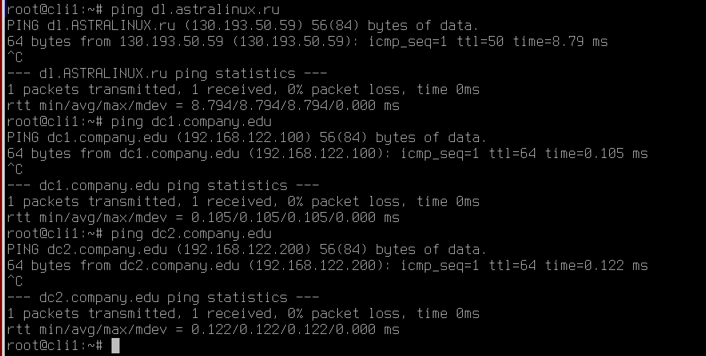

3. Файл **/etc/apt/sources.list** или **/etc/apt/sources.list.d** настроен на работу с репозиториями: 

Для Astra Linux 1.7.4 - 

```
deb http://dl.astralinux.ru/astra/frozen/1.7_x86-64/1.7.4/repository-main 1.7_x86-64 main non-free contrib
deb http://dl.astralinux.ru/astra/frozen/1.7_x86-64/1.7.4/repository-update 1.7_x86-64 main contrib non-free
deb http://dl.astralinux.ru/astra/frozen/1.7_x86-64/1.7.4/repository-base 1.7_x86-64 main non-free contrib
deb http://dl.astralinux.ru/astra/frozen/1.7_x86-64/1.7.4/repository-extended 1.7_x86-64 main contrib non-free

deb https://download.astralinux.ru/aldpro/frozen/01/2.3.0 1.7_x86-64 main base
```

Для Astra Linux 1.7.5 - 

```
deb http://dl.astralinux.ru/astra/frozen/1.7_x86-64/1.7.5/repository-main 1.7_x86-64 main non-free contrib
deb http://dl.astralinux.ru/astra/frozen/1.7_x86-64/1.7.5/repository-update 1.7_x86-64 main contrib non-free
deb http://dl.astralinux.ru/astra/frozen/1.7_x86-64/1.7.5/repository-base 1.7_x86-64 main non-free contrib
deb http://dl.astralinux.ru/astra/frozen/1.7_x86-64/1.7.5/repository-extended 1.7_x86-64 main contrib non-free

deb https://download.astralinux.ru/aldpro/frozen/01/2.3.0 1.7_x86-64 main base
```

4. После подключения новых репозиториев, выполните обновление пакетной базы и самой операционной системы с опцией **--force-confnew** для обновления конфигруационных файлов всех служб.

```
sudo apt update
sudo apt list --upgradable
sudo apt dist-upgrade -y -o Dpkg::Options::=--force-confnew
```

5. Выполнить установку aldpro-client

```
sudo DEBIAN_FRONTEND=noninteractive apt-get install -y -q aldpro-client
```

Комментарии к использованным ключам можно найти в прошлой главе по установке пакетов на контроллере домена.

Если перезагружать пользовательский компьютер сейчас, то в сообщениях ядра можно будет увидеть ошибки запуска SSSD и зависящих от нее служб (журнал загрузки можно найти в файле **/var/log/boot.log**). 

Это происходит по причине того, что служба еще не настроена соответствующим образом (журнал службы sssd можно найти в файле **/var/log/sssd/sssd.log**).

При установке клиента в системе устанавливается более 130 зависимостей.


# Ввод компьютера в домен

Команда нам уже знакома: 

```
sudo /opt/rbta/aldpro/client/bin/aldpro-client-installer --domain company.edu --account admin --password 'P@ssw0rd' --host cli1 --gui --force
```

Но давайте также изучим графический интерфейс утилиты? 

Запустить его можно, если обратиться к команде без каких-либо ключей

```
sudo /opt/rbta/aldpro/client/bin/aldpro-client-installer 
```

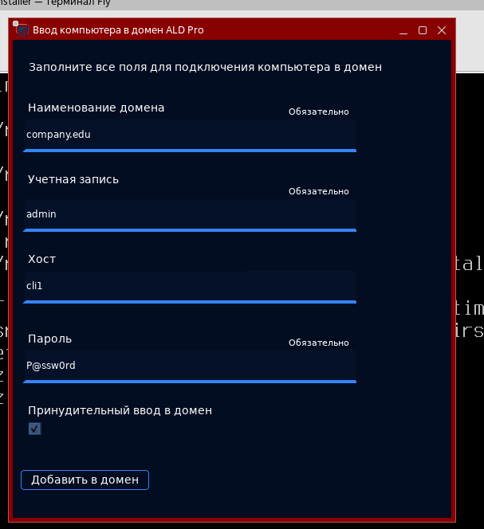

## Мы для входа используем учетную запись admin, но в реальной жизни так никто не делает. Как исправить? 

Замечаение верное, использовать учетную запись admin допускается в лабораторных и тестовых стендах, или в очень маленьких компаниях. Но в организациях с большим штатом ИТ специалистов каждому сотруднику будут делегироваться права администратора на его учетную запись, без использования единой **admin**.

Каждый использует свою, со своим паролем и настройками. 

Права доступа в службе каталога FreeIPA назначаются с помощью трехуровневой модели безопасности, которая включает в себя Роли (Roles), Привилегии (Privileges) и Разрешения (Permissions). На базовом уровне разрешениям соответствуют инструкции управления доступом 389 Directory Server (Access Control Instructions, ACI), с помощью которых можно предоставить доступ на чтение, запись, поиск идругие действия применительно ко всему каталогу, его ветке или конкретной записи. 


Разрешения группируются в привилегии, привилегии группируются в роли, а роли уже назначаются пользователям.В домене «ALD Pro» уже есть роль «Enrollment Administrator», которая включает привилегию «Host Enrollment», объединяющую почти все необходимые разрешения за исключением права на создание хостов «System: Add Hosts», поэтому самым простым способом решения задачи делегирования является расширение списка разрешений и назначение роли «Enrollment Administrator» соответствующему пользователю.

Удобнее всего выполнить эту настройку через командную строку. 

Так, с доменного контроллера, выполнив авторизацию под доменной УЗ admin или получив Kerberos-ключ, введите команду:

```
ipa privilege-add-permission 'Host Enrollment' --permissions='System: Add Hosts'

ipa role-add-member 'Enrollment Administrator' --users=<имя_пользователя>
```

Например: 

```
ipa privilege-add-permission 'Host Enrollment' --permissions='System: Add Hosts'
ipa role-add-member 'Enrollment Administrator' --users=enrolladmin
```

А если захочется сделать собственную роль, то можно сделать так: 

```
ipa privilege-add 'COMPANY.EDU Host enrollment' --desc='Ввод новых компьютеров в домен'

ipa privilege-add-permission 'COMPANY.EDU Host enrollment' \
--permissions='System: Add Hosts' \
--permissions='System: Add krbPrincipalName to a Host' \
--permissions='System: Enroll a Host' \
--permissions='System: Manage Host Certificates' \
--permissions='System: Manage Host Enrollment Password' \
--permissions='System: Manage Host Keytab' \
--permissions='System: Manage Host Principals'
ipa role-add 'COMPANY.EDU Host enrollment' --desc='Участники роли имеют привилегии, необходимые для регистрации новых компьютеров в домене'

ipa role-add-privilege 'COMPANY.EDU Enrollment Administrator' --privileges='COMPANY.EDU Host enrollment'

ipa role-add-member 'COMPANY.EDU Enrollment Administrator' --users=enrolladmin
```

Пример, как получить Kerberos-ключ через kinit  на скриншоте: 

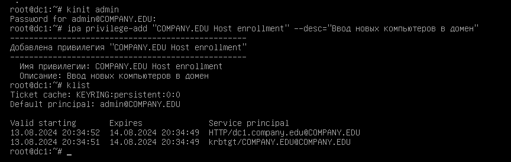

После создания роли назначит её пользователям можно также через веб-интерфейс ALD Pro: «Управление доменом --> Роли и права доступа --> Роли в системе»

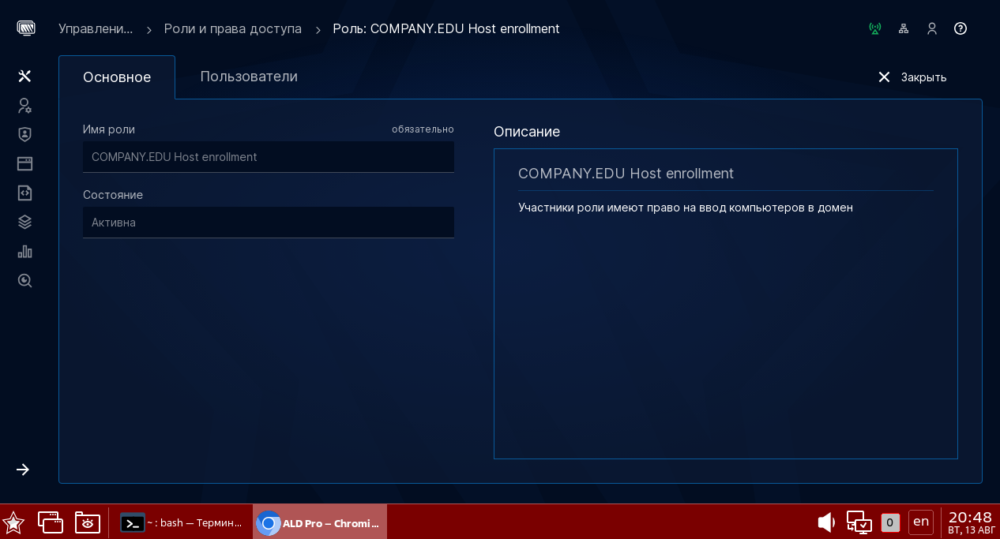

Также, добавить роль можно как пользователям, так и целым группам. Таким образом права на ввод в домен можно наследовать и делегировать удобнее.

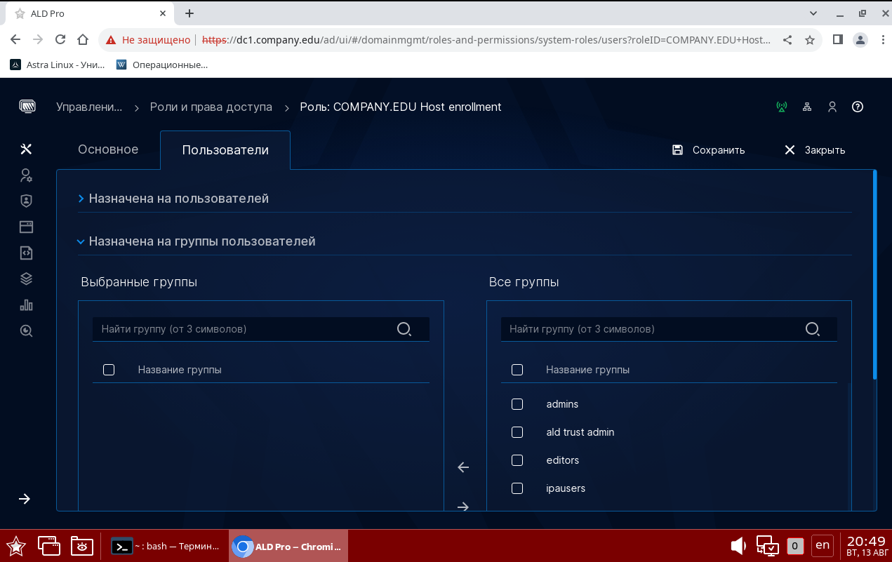

# Присоединение компьютера заранее

Наверняка, опытные администраторы  слышали про Microsoft-Windows-UnattendedJoin.

Microsoft-Windows-UnattendedJoin — это компонент Windows, который используется для автоматизированного присоединения компьютера к домену Active Directory во время установки операционной системы. 

Проще говоря, этот компонент позволяет Windows автоматически, без вмешательства пользователя, стать частью корпоративной сети, управляемой системой Active Directory.

В ALD Pro можно реализовать примерно похожий функционал, правда пока сам ALD Pro так не умеет, только через FreeIPA.

Для создания учетной записи и установки одноразового пароля привилегии администратора домена потребуются, но все эти действия можно выполнить на контроллере домена заранее, в том числе с использованием инструментов автоматизации, а на стороне рабочей станции в дальнейшем сотрудникупотребуются привилегии только локального администратора. В этом случае, получается, что вам не нужно делегировать пользователям права администратора, а также не придется никому сообщать о пароле **admin**. 

Плюсов - масса!

Одноразовые пароли в настоящее время можно использовать только со стандратным клиентом FreeIPA, но полная поддержка этого сценария в клиентской части «ALD Pro» планируется уже в, т. 
к. этот способ обладает несколькими преимуществами:
* Учетная запись хоста может быть создана сразу в правильном организационном подразделении, чтобы на него распространялось действие необходимых групповых политик.

* Учетную запись хоста можно сразу включить во все группы, чтобына него распространялись необходимые правила HBAC и SUDO.

* Для ввода машины в домен на стороне рабочей станции не нужно будет использовать пароль привилегированной учетной записи.Продемонстрируем работу данного сценария на примере утилиты 
ipa-client-install. Сначала нужно создать учетную запись компьютера с помощью команды ipa host-add, используя ключ --random для генерации одноразового пароля:

На доменном контроллере - 

```
kinit admin
ipa host-add cli2.company.edu --random --ip-address=192.168.122.101 --force
```

Результат выполнения будет: 

```
--------------------------------------
Добавлен узел "cli2.company.edu"
--------------------------------------
 Имя узла: cli2.company.edu
 Случайный пароль: e5jgR1tcsYlrbx7MqecUlPhD
 Link to department: 
ou=company.edu,cn=orgunits,cn=accounts,dc=company,dc=edu
 Пароль: True
 Таблица ключей: False
 Managed by: cli2.company.edu
```

На стороне компьютера клиента останется назначить хосту правильное имя и выполнить команду ipa-client-install, используя одноразовый пароль, 
полученный на предыдущем шаге:

```
sudo hostnamectl set-hostname cli2.company.edu
sudo ipa-client-install --mkhomedir --password='e5jgR1tcsYlrbx7MqecUlPhD' -U
```

# Ввод компьютера с одним и тем же именем

Например, если администратор переустанавливает компьютер с тем же именем, то он неминуемо столкнется с проблемой - в домене уже есть компьютер с таким именем и добавить второй не получится. 

Как это можно исправить? 

1. Самый простой вариант - удалите компьютер через веб-интерфейс ALD Pro, подождите около 10 минут, чтобы репликация отсинхронизировалась и смело вводите компьютер вновь.

2. Повторно добавить машину в домен, используя выданный ранее keytab-файл хоста. 


-----------

Keytab-файл — это файл, используемый в Kerberos-аутентификации для хранения паролей шифрования (ключей), которые ассоциированы с учетными записями пользователей или сервисов. Keytab-файлы позволяют сервисам и системам аутоматизировать процесс аутентификации без необходимости ручного ввода пароля каждый раз. Они особенно полезны в средах, где необходимо автоматическое и безопасное взаимодействие между различными сервисами.

-----------

Заранее сохраните **/etc/krb5.keytab** на отдельный ресурс. После переустановки компьютера и установки на компьютер такого же имени как раньше, загрузите keytab обратно. И выполните команду: +

```
sudo ipa-client-install -U -k /home/localadmin/krb5.keytab
```

После этого компьютер будет введен в домен. 


# "Будьте точны во времени, ибо потерянное время уже не догнать." - цитата неизвестного автора

Вопрос времени в доменной инфраструктуре крайне важен. И не важно, ALD Pro или Microsoft ActiveDirectory у вас в работе.

Для протокола Kerberos важно, чтобы время на клиенте и сервере было синхронизировано с точностью до 5 минут по следующим причинам:

* Безопасность. Kerberos использует временные метки для предотвращения атак типа повторного воспроизведения (replay attacks). Когда клиент запрашивает сервисный билет у сервиса аутентификации, этот билет содержит временную метку. Если время на клиенте и сервере сильно расходится, сервер может отклонить запрос, считая его невалидным или повторным.


* Надежность. Требование синхронизации времени до 5 минут позволяет удостовериться, что аутентификационные данные не устаревают и остаются действительными в течение короткого периода времени. Это, в свою очередь, помогает поддерживать надежность работы системы и исключать просроченные билеты.

По умолчанию в Astra Linux синхронизация времени отключена, но в некоторых виртуальных средах машины берут время из хостовой операционной системы во время загрузки после полного выключения, 
поэтому отсутствие синхронизации времени можно заметить только при работе с горячими снимками, которые были сделаны во время работы операционной системы.

При установке «ALD Pro» (как клиентской, так и серверной части) в системе появляется служба chrony, содержание конфигурационного файла которой автоматически редактируется через механизм 
групповых политик в соответствии с текущими настройками домена «Роли и службы сайта \ Служба синхронизации времени». 

Пользовательские компьютеры синхронизируют время с контроллером, а контроллер берет его у публичных серверов.

Вот информация с нашего ДК: 

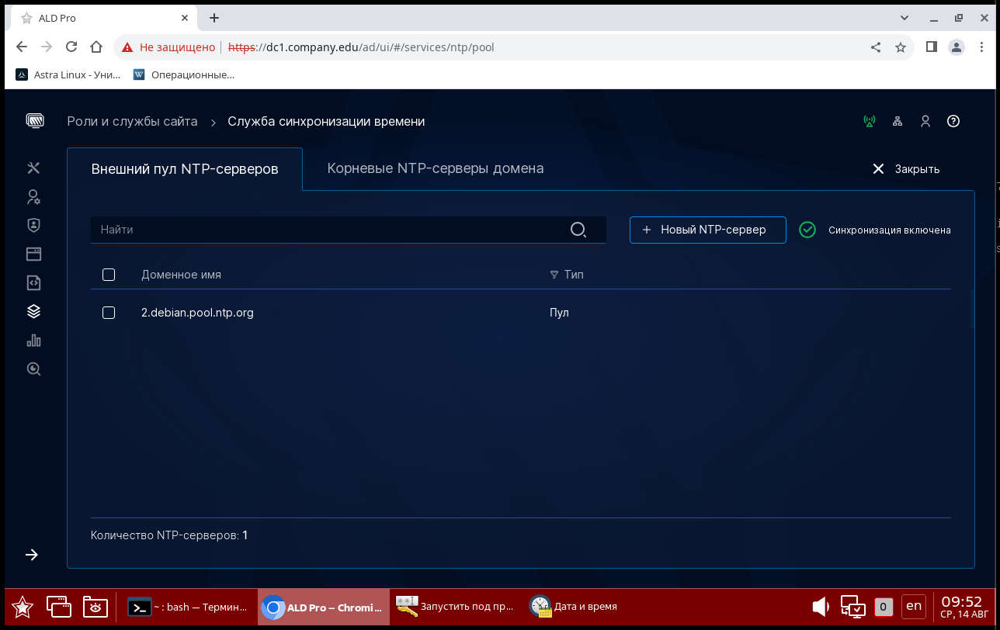

Здесь мы можем узнать, откуда наш доменный контроллер получает время, причем это же значение доменный контроллер установит на все клиентские компьютеры, если они смогут подключиться к этим пулам NTP-серверов. 

А на данной вкладке мы узнаем, какие NTP-сервера развернуты в нашей инфраструктуре. 

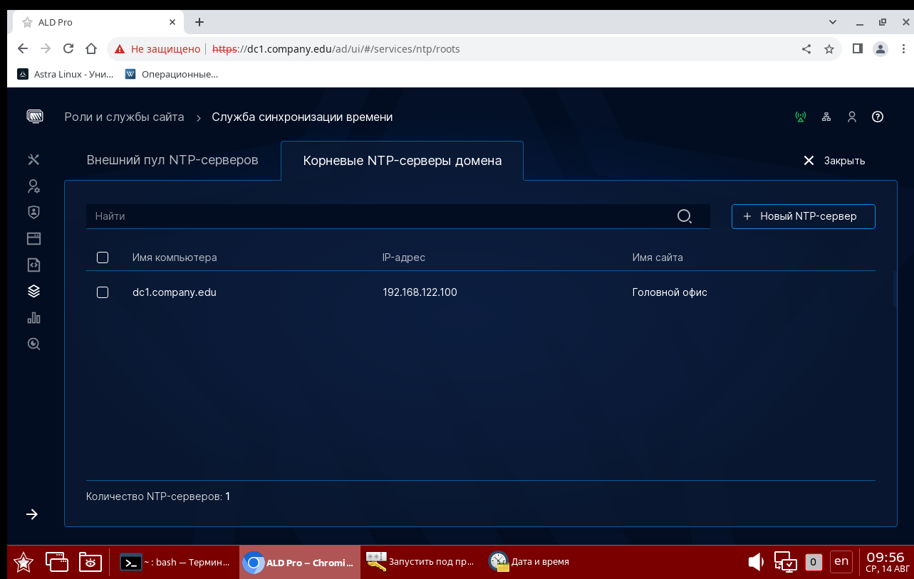


На стороне клиентского компьютера выяснить статус синхронизации и сервера можно с помощью команды:

```
chronyc sources -v
```

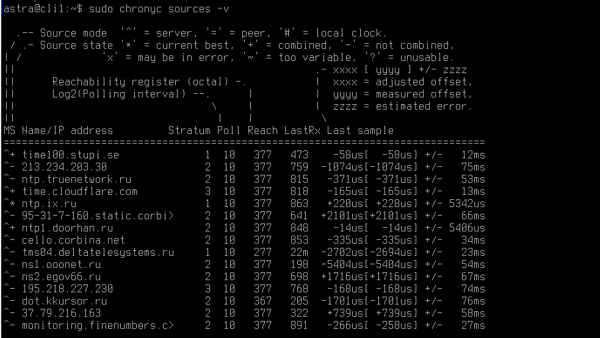


А внести корректировки, или получить настройки можно через конфигурационный файл - **/etс/chrony/chrony.conf**.

## Я изменил значения Chrony на доменном контроллере, как обновить их централизованно везде?

Помните команду **gpupdate /force** , которая вам может быть знакома после опыта эксплуатации Windows-инфраструктуры. В Astra Linux и ALD Pro есть аналог: 

```
systemctl restart salt-minion
```

Принудительно запустить синхронизацию времени можно перезапуском службы Chrony:

```
sudo systemctl restart chrony
```

В настройках chrony, которые использует «ALD Pro», указан параметр **makestep**, поэтому при выполнении синхронизации компьютер сразу устанавливает требуемое значение. Если отсутствует параметр 
makestep, то служба будет крайне медленно «подтягивать» время к требуемом значению (по несколько секунд в минуту). Форсировать переход к целевому значению в этом случае можно вызовом команды 
makestep через chronyc:

```
sudo chronyc makestep
```


# Как вывести машину из домена ALD Pro? 

Вывод машины из домена может быть актуальным по различным причинам. Вот некоторые из них:

1. Реорганизация ИТ-инфраструктуры: Изменения в организации могут привести к снижению потребности в централизованном управлении через домен. Например, при слияниях и поглощениях часто происходит консолидация или реструктуризация доменов.

2. Безопасность: Возможно, машина была скомпрометирована или замечена подозрительная активность. В этом случае вывод из домена может быть временной мерой для уменьшения риска распространения угроз.

3. Смена политики или поставщика услуг: Переход на другие системы управления или изменение политики компании может сделать использование доменов избыточным или ненужным.

4. Обновление оборудования: При замене старого оборудования на новое может быть легче сделать чистую настройку, без привязки к существующему домену.

5. Выход компьютеров из эксплуатации: Устройства, которые выводятся из активного использования или утилизируются, должны быть удалены из домена для снижения административного оверхеда и безопасности.

6. Нарушение или ошибки в конфигурации: Неправильная или ошибочная конфигурация может требовать перерегистрации или исправления за счет новой установки без привязки к домену.

7. Временное удаление: В случае временного использования компьютеров в другой сети без доменного контроля, например, в командировках или удаленной работе.

8. Лицензирование и соблюдение нормативных требований: Изменения в лицензировании или нормативных требованиях могут потребовать удаления определённых машин из доменной среды.

9. Диагностика и устранение неполадок: Для диагностики проблем с подключением или производительностью иногда может понадобиться временно отключить машину от домена.

10. Изменение роли машины: Если устройство меняет свою функцию, например, из общей рабочей станции становится специализированным приложением или сервером, его может быть необходимо вывести из домена.

Каждая причина имеет свои особенности и обстоятельства, которые могут влиять на конечное решение о выводе машины из домена.

**Чтобы удалить машину из домена, а также полностью очистить доменный кэш, файлы конфигураций и любые упоминания былого существования необходимо сделать следующее:**

1. Первым делом, необходимо удалить конфигурационные файлы FreeIPA. Это можно сделать автоматически, выполнив команду:


```
astra-freeipa-client -U
```

При выполнении команды в системе происходят следующие действия:

* В службе каталога снимается отметка о том, что хост зарегистрирован в домене;

* Ключи хоста удаляются из файла /etc/krb5.keytab;

*  Содержимое конфигурационных файлов /etc/krb5.conf, /etc/ldap/ldap.conf и др. приводится в исходное состояние;

* К имени файла конфигурации /etc/sssd/sssd.conf добавляется суффикс .deleted;

* Учетная запись **admin**, как и любые доменные учетные записи, перестанут работать на компьютере.

2. Далее следует удалить пакеты приложений, используя команду **purge**, чтобы удалить все конфигурационнные файлы и логи:

```
apt purge 'aldpro*' 'freeipa*' 'sssd' 'krb5*'
apt autoremove --purge
```

Данной командой мы удалим все зависимости программного комплекса. 

3. Очистка профилей в домашней папке **/home**.

Перед удалением - убедитесь, что все важные файлы пользователей сохранены.

```
cd /home && ls
```

В результате вы найдете профили пользователей, которые работали за этим компьютером - ведь после каждого входа в систему создаются пользователю, по умолчанию, создается домашниий каталог. 

Например:

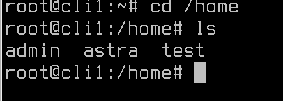

Конкретно в примере выше, пользователи **admin**, **test** являются доменными, а значит на недоменном компьютере больше не нужны. Смело удаляйте!

```
rm -rf /home/test
```

4. Удалить то, что не смог почистить **APT**.

```
sudo rm -rf /var/lib/sss/pubconf/krb5.include.d/
sudo rm -rf /etc/krb5.conf.d/
sudo rm -rf /var/lib/sss/
sudo rm -rf /etc/sssd/
sudo rm -rf /opt/rbta/aldpro/
sudo rm -rf /etc/syslog-ng/aldpro/
sudo rm -rf /etc/salt/minion.d/
sudo rm -rf /var/log/salt/
sudo rm -rf /var/lib/certmonger/
```

## А на сервере что-то нужно делать? 

Да, желательно дополнительно очистить все упоминания о старом клиенте.

Авторизовавшись под пользователем **admin**, выполните команду:

```
ipa dnsrecord-del company.edu cli1 --del-all
```

Где:

* **company.edu** - доменная зона инфраструктуры ALD Pro;

* **сli1** - короткое имя удаляемого компьютера;


Результат выполнения: 

```
---------------------
Удалена запись "cli1"
---------------------
```

Удалить компьютер и базы данных FreeIPA: 

```
ipa host-del cli1.company.edu
```


Результат выполнения: 

```
----------------------------------
Удалён узел "cli1.company.edu"
----------------------------------
```

В завершение на каждом контроллере нужно выполнить команду для удаления Salt ключа компьютера, чтобы исключить попытки обращения со стороны Salt Master к этой рабочей станции при обработке 
широковещательных запросов:

```
sudo salt-key -y -d cli1.company.edu
```

Результат выполнения: 

```
The following keys are going to be deleted:
Accepted Keys:
cli1.company.edu
[INFO] Rotating AES key
Key for minion cli1.company.edu deleted.
```


# Групповые политики в ALD Pro

Групповые политики позволяют снизить стоимость управления ИТ-инфраструктурой за счет автоматического применения одинаковых настроек на больших группах компьютеров, имеющих общее целевое назначение.


Каждая политика (в терминах MS объект групповой политики) представляет из себя именованный набор параметров, в соответствии с которыми производится автоматическая настройка операционной системы и прикладного программного обеспечения. Для настройки групповой политики нужно выполнить следующие действия:

* создать новую групповую политику;

* добавить конфигурационный параметр в политику (включить его);

* установить желаемые значения атрибутов для параметра;

* назначить политику на подразделение, внутри которого есть целевые компьютеры или пользователи;

* подождать 30 минут или перезапустить службу salt-minion, чтобы форсировать применение политики на пользовательском компьютере.

Администраторам доступны сотни параметров «из коробки», но для решения специфичных задач конкретного бизнеса может потребоваться разработка дополнительных параметров силами команды внедрения, и в ALD Pro для этого есть все необходимые инструменты.

В основе механизма групповых политик ALD Pro лежит SaltStack — система управления конфигурациями и удаленного выполнения операций с открытым исходным кодом, написанная на языке Python. SaltStack работает по модели «издатель — подписчик», поэтому базовыми компонентами архитектуры являются: мастер (издатель), минионы (подписчики) и шина данных.


* Мастер — это сервер, выполняющий централизованное конфигурирование рабочих станций. Данная служба работает на контроллерах домена в отказоустойчивом мультимастер-режиме, то есть политики реплицируются между контроллерами, и миньоны могут подключаться к любому из них.

* Минионы — это рабочие станции или серверы, выступающие в роли клиентов по отношению к мастеру, и принимающие от мастера команды на удаленное конфигурирование. Служба миниона запускается на всех хостах в домене, в том числе и контроллерах домена, где работает Salt Master.


* Шина данных — это система для передачи сообщений на базе ZeroMQ, через которую минионы получают команды на конфигурирование и передают результаты об их исполнении. Шина работает на мастере, минионы устанавливают постоянное соединение с шиной по порту TCP/4505 для получения заданий (порт издателя, publisher) от мастера, а для отправки отчетов о выполнении заданий периодически подключаются к нему по порту TCP/4506 (порт сервера запросов, request server). На уровне бизнес-логики применение групповых политик на минионе возможно как в pull-режиме по инициативе 
миниона (через утилиту salt-call), так и в push-режиме по инициативе мастера (через утилиту salt и файл _schedule.conf).

## Для начала обсудим стандартные групповые политики и как с ними работать

Перейти к ним можно через Панель управления --> "Групповые политики" 

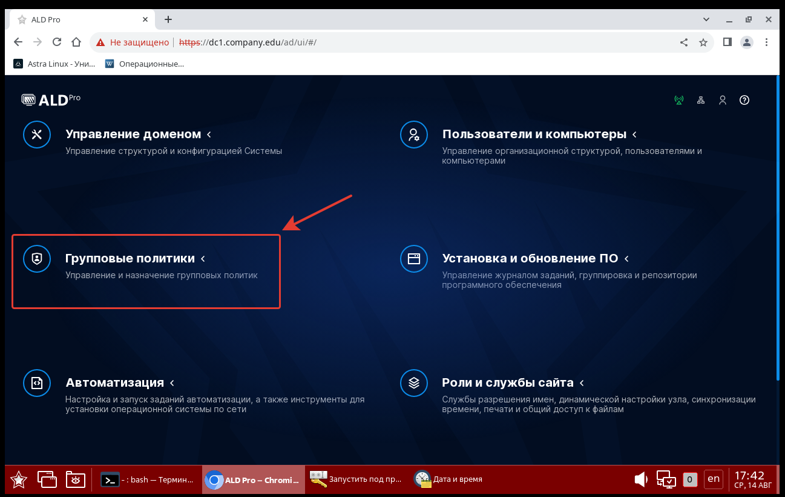

Далее, кликните "Новая групповая политика"

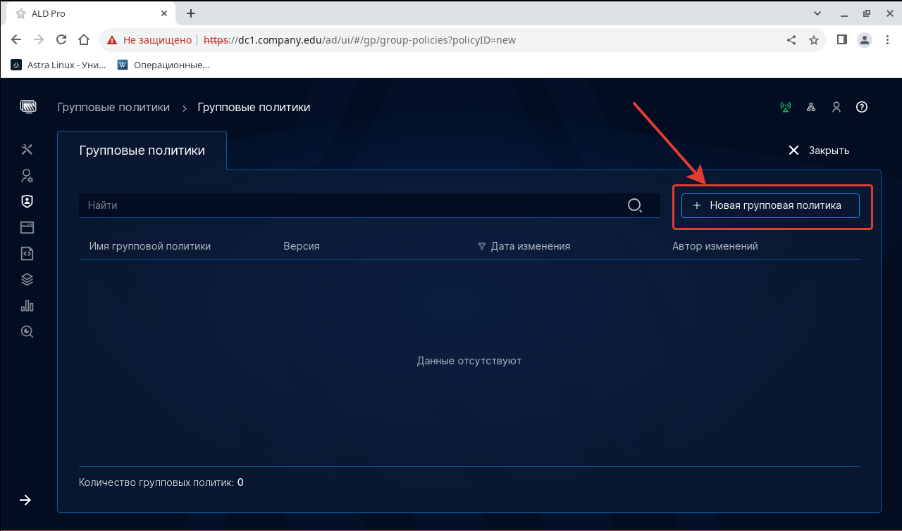

Введите имя вашей групповой политики. Имя групповой политики вводится без пробелов. Можно использовать русский и английский языки для настройки имени.

Например, в нашем случае название будет - Enable-Mount-Lock. Политика будет выключать монтирование блочных устройств для непривелигированных пользователей. 

Нажмите **Сохранить**, и после этого остальные параметры меню конфигурирования групповой политики станут доступны. 

## Настроим блокировку блочных устройств? 

Переходим на Параметры компьютеров --> Безопасность --> Политика безопасности --> Системные параметры. 

Воспользуйтесь встроенной справкой в интерфейсе, чтобы разобраться какие параметры и значения стоит вносить

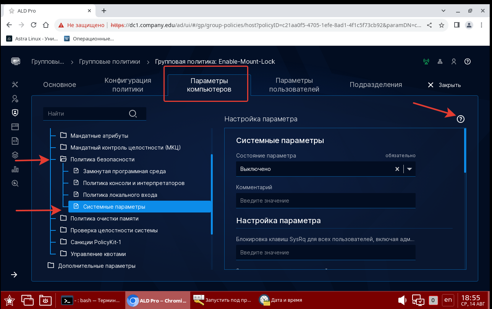


Вывод справки выглядит вот так:

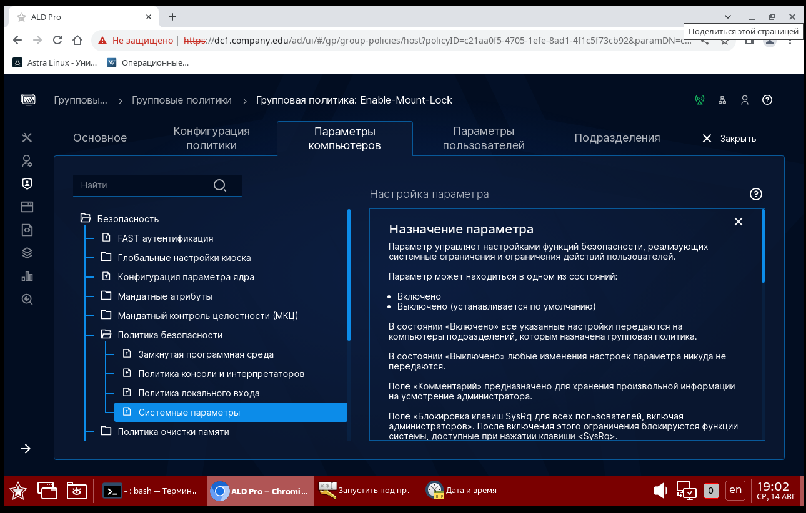

### А точно все сработает?

Давайте, для чистоты эксперимента проверим статус политики: 

```
astra-mount-lock status
```

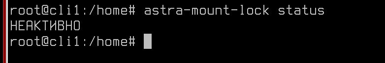

Команда возвращает отключенную политику.


### Вернемся к настройке

Состояние параметра --> "Включено"


А в параметре "Запрет монтирования", указываем просто **enable**


Далее пролистайте ниже и кликните "Применить". Чтобы проверить корректность установки, перейдите на вкладку "Конфигурация политики"

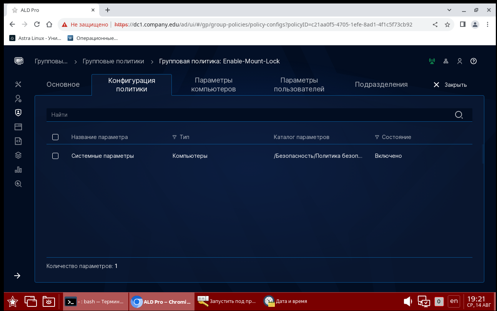

Ваша политика будет тут. 

А на вкладке подразделения, укажите к какому контроллеру домена она относится

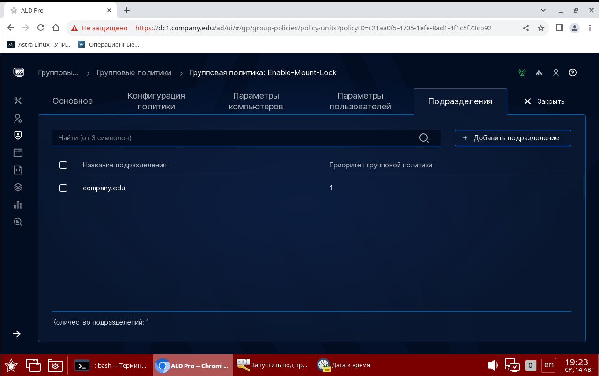

**Все готово, как применить политику на клиентах?**


### Печальный опыт автора статьи, а также членов сообщества ALD Pro

1. Как мы все прочитали и знаем из руководств администратора политики должны применяться по двум событиям:

	- при перезагрузке системы

	- при сработке таймера из двух составляющих: постоянная величина - 30 мин., динамическая - от 5 до 50 минут
		
      Постоянную и динамическую величину можно изменить на рабочей станции (для salt-minion-standalone):

		- постоянную в файле :/srv/salt/standalone/roots/_modules/utils.py (изменить переменную _25_MINUTES)

		- динамическую в файле /srv/salt/standalone/config/minion.d/standalone_scheduler.conf

	Значение сработки по следующему таймеру можно увидеть командой (без динамической составляющей):
		- для политики установки ПО: salt-call schedule.show_next_fire_time build_and_run_swp -c /srv/salt/standalone/config

      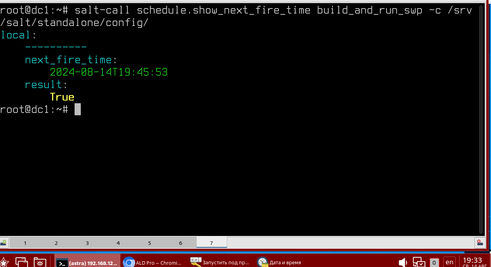

		- для групповых политик: salt-call schedule.show_next_fire_time build_and_run_gp -c /srv/salt/standalone/config

      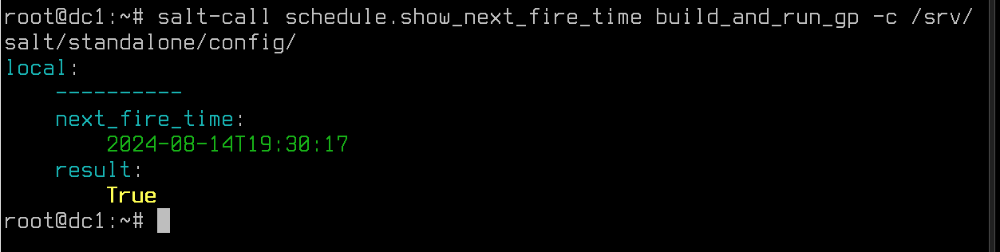

	Выяснилось, что при перезагрузке все-таки групповые политики применяются НЕ всегда (не гарантировано).

	В процессе эксплуатации у крупных клиентов контроллеры домена начинали выключаться автоматически
	из-за критической утилизации ресурсов (CPU, RAM), что приводило к не возможности авторизоваться в домене и получить доступ к ресурсам. Особено сильно это проявлялось утром рабочего дня - когда пользователи массово включают компьютеры и создают огромную нагрузку. 
   
   Механизм был переработан и исключено ОБЯЗАТЕЛЬНОЕ (гарантированное) применение при перезагрузке.

	Но ничто не мешает это реализовать через PAM_EXEC. 
Например:

- 	В файл /etc/pam.d/common-session добавить выполнение скрипта в котором принудительно включить применение политики. 
   Получится даже отработка при  каждом повторном входе пользователя в систему (без перезагрузки). 

	Строка для добавления в самом конце файла:
   
   ```
	session optional pam_exec.so seteuid log=<файла лога> <файл скрипта>
   ```
	Скрипт должен быть исполняемым и со следующим содержимым:

```
	---------------------------------------------
	#!/bin/bash

	if ["\$PAM_TYPE" != "close_session"]; then
		salt-call gp_sum.build_and_run_gp force=True -c /srv/salt/standalone/config &
        	exit 0
	fi	
	---------------------------------------------	
```


2. Применяются групповые политики ТОЛЬКО для определенных типов сессий. Для xRDP - НЕ ПРИМЕНЯЕТСЯ.
	
	Через вход с консоли все политики применяются. Проверено как на виртульной машинке, так и на железе.

	Применяются как по таймеру, так и при форсировании командой:

	- salt-call gp_sum.build_and_run_gp force=True -c /srv/salt/standalone/config
	
Так, например, после выполнения команды 

```
salt-call gp_sum.build_and_run_gp force=True -c /srv/salt/standalone/config
```

В логах выполнения команды сумасшедшее количество разных значений, среди них есть и наша настройка по запрету монтирования пользователям блочных устройств:

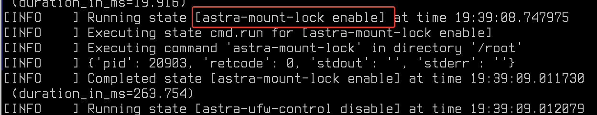

Политика запрета на монтирование ресурсов включается, проверенно надежной командой:

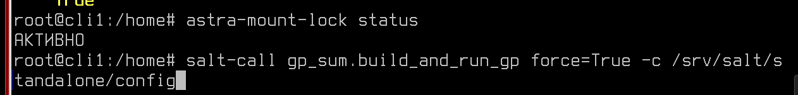


3. Некоторые политики НЕ ОТКАТЫВАЮТСЯ. В частности политики создающие/модифицирующие переменные среды. 

Т.е. если создать и применить политику, где будет назначаться прокси через переменные https_proxy и тд, то если политику отключить или удалить, то в профиле пользователя в файле /home/<имя пользователя>/.bashrc переменные останутся.

Говорят, что изучают эту проблему. Вероятно исправят в следующей версии (2.4.0).

Пока, в настоящий момент, для решения предлагают создавать отдельную политику отката или через автоматизацию.


# Как создать собственную групповую политику? 

Встроенных в ALD Pro политик очень много - изучайте и вдумывайтесь в них! Умение работать с данным инструментом существенно упростит и снизит нагрузку на ИТ-отдел.

Но раз ALD Pro использует SaltStack, что мешает нам создавать собственные политики? 

**Ничего!**

Через веб-интерфейс это сделать невозможно, для этого создайте собственный sls-файл.

sls-файл — это файл, используемый в системе управления конфигурациями SaltStack (Salt). Он написан на языке разметки YAML и содержит состояния (states), которые определяют, какие действия необходимо выполнить на управляемых узлах. SLS — это аббревиатура от Salt States File.

Пример содержания sls-файла может выглядеть так:

```
install_nginx:
  pkg.installed:
    - name: nginx

start_nginx:
  service.running:
    - name: nginx
    - enable: True
    - require:
      - pkg: install_nginx
```

В этом примере файл описывает два состояния:
1. install_nginx: установка пакета nginx.
2. start_nginx: запуск и включение сервиса nginx, если пакет установлен.

## Как создать свой SLS-файл и применить его на все компьютеры в домене? 

```




add_repo_kesl:
    pkgrepo.managed:
        - humanname: klnagent
        - name: deb [trusted=yes] http://repo.ru/repos/klnagent/ klnagent main
        - dist: klnagent
        - file: /etc/apt/sources.list.d/klnagent.list
        - refresh_db: true
copy_autoanswers:
    file.managed:
        - name: /opt/keslautoanswers.conf
        - source: http://repo.ru/repos/files/keslautoanswers.conf
        - mode: 744
        - makedirs: True
        - skip_verify: True
add_env_kesl:
    environ.setenv:
        - name: KLAUTOANSWERS
        - value: /opt/keslautoanswers.conf
        - update_minion: True
install_klnagent64:
    pkg.installed:
        - fromrepo: klnagent
        - pkgs:
            - klnagent64

```

Разберем сразу сложный пример, сверху представлен скрипт установки Касперский Агент для всех компьютеров в домене ALD Pro. Файл называется **klnagent_install.sls** и располагается в каталоге - **/root/salt_gpo/**.

Перейдите в каталог **/root/salt_gpo/**  и выполните команду:

```
salt '*' state.apply klnagent_instal
```

В этой команде:
- '*' указывает на целевую группу всех миньонов (вы можете использовать различные шаблоны для выбора конкретных групп миньонов). "Звездочка" укажет на всех миньонов
- state.apply — команда для применения состояния.
- klnagent_instal — это имя состояния, которое соответствует файлу klnagent_insta.sls (имя файла без расширения).

Эта команда заставит всех миньонов выполнить действия, определённые в klnagent_insta.sls. Вы должны увидеть вывод, содержащий результаты выполнения команды на каждом из миньонов.

Вывод может быть примерно таким: 

```
cli1.company.edu:
----------
          ID: add_repo_kesl
    Function: pkgrepo.managed
        Name: klnagent
      Result: True
     Comment: repository is already installed.
     Started: 12:34:56.789012
    Duration: 1234.567 ms
     Changes:   

...

Summary for cli1.company.edu
------------
Succeeded: 2 (changed=0)
Failed:    0
------------
Total states run:     2
Total run time:   1.234 s
```

Таким образом, вы сможете отcлеживать выполнение вашей групповой политики. 

Дополнительную информацию о собственных групповых политиках вы можете получить из документа по ссылке - [Ссылка](https://disk.yandex.ru/i/kVUpp2KI66V2nA)


# Дополнительная информация:
1) SaltStack - подробности и откровения  [Ссылка](https://habr.com/ru/articles/549874/)
2) AldPro: Ввод в домен [Ссылка](https://dzen.ru/a/ZONW-qTHO3qCUbz3)
3) Ald Pro - Ошибки в групповых политиках [Ссылка](https://ald-pro.com/forums/gruppovye-politiki.10/)