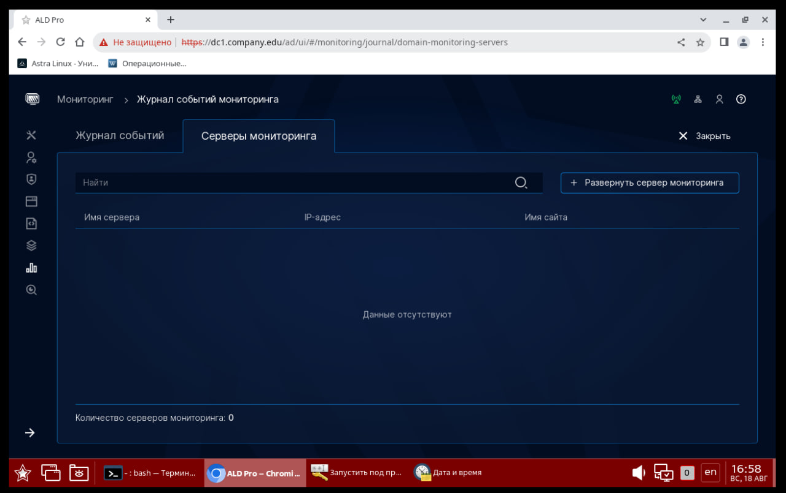
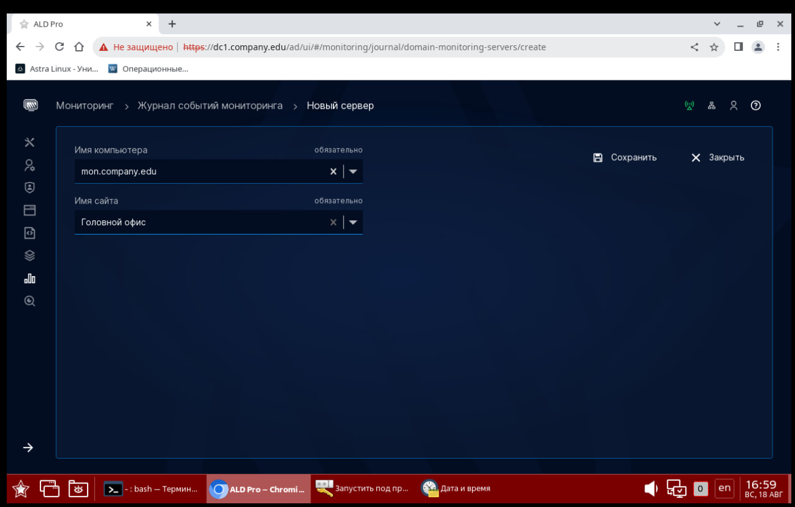
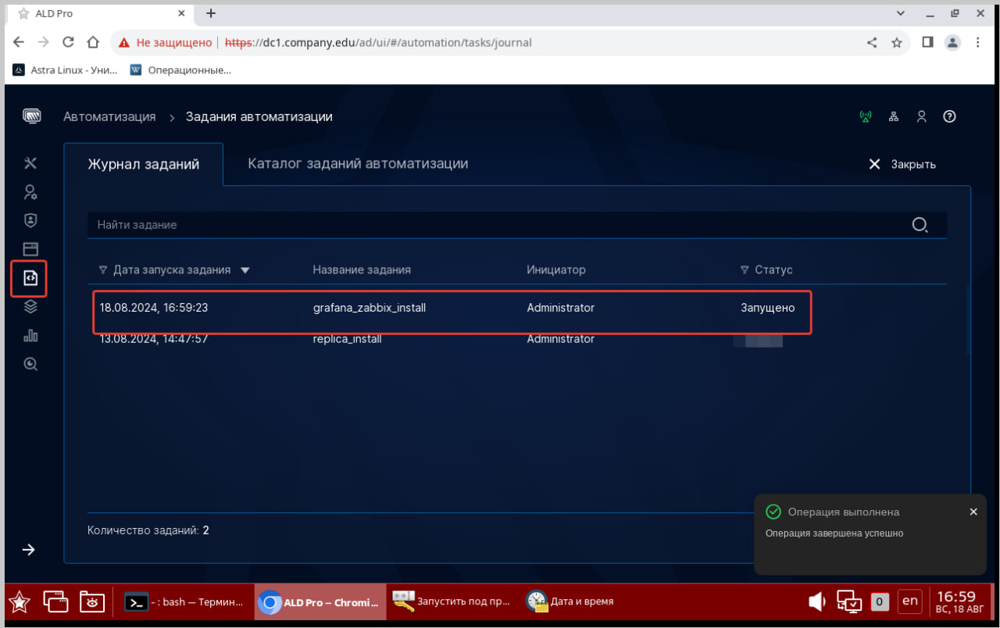
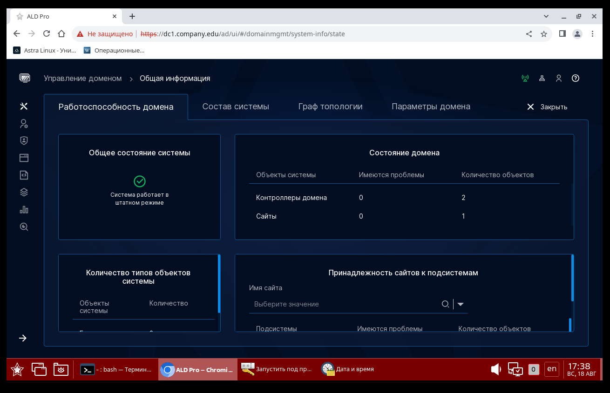
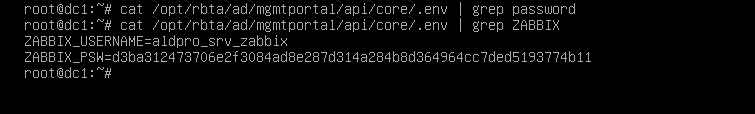
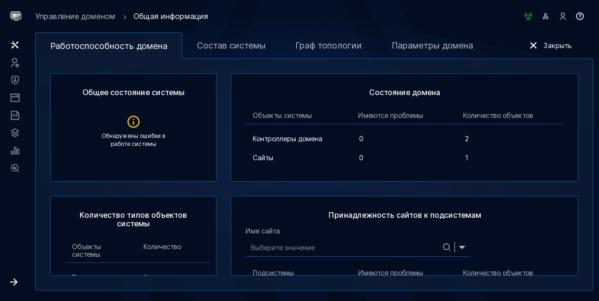
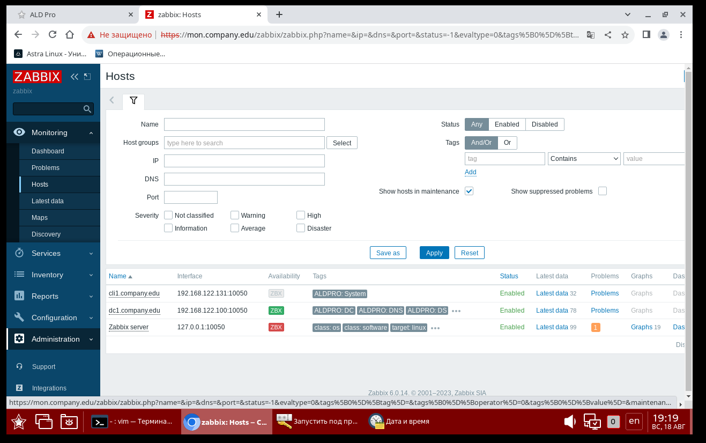
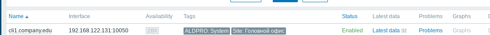
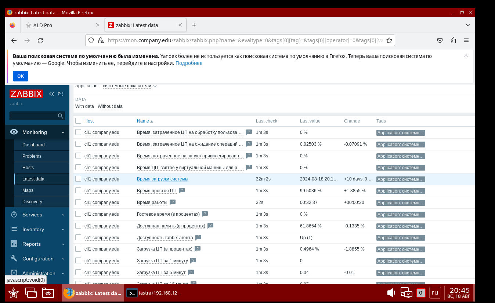
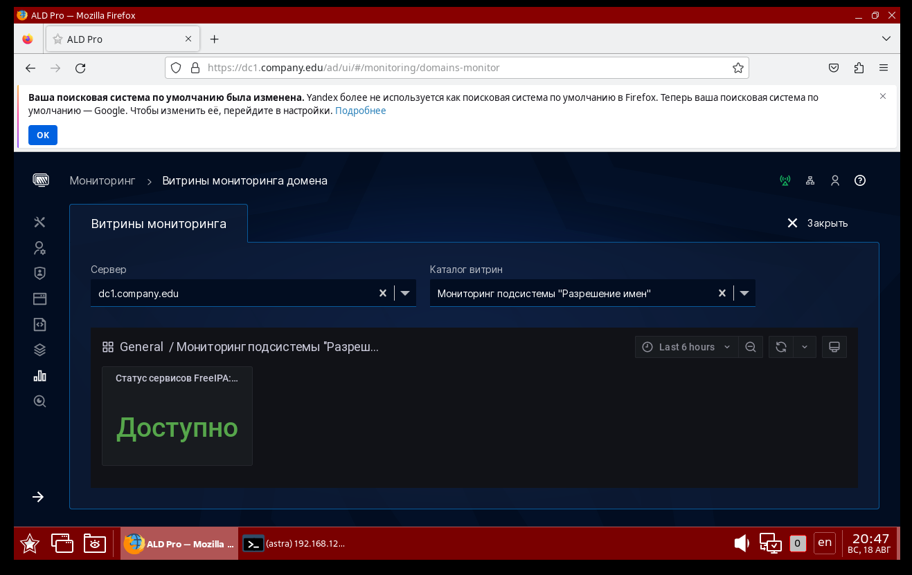

# Глава 4 "Резервирование, мониторинг и журналирование ALD Pro"
Цель главы
----------

1. Обучение и повышение квалификации: Предоставить администраторам и пользователям системы ALD Pro знания и инструкции по настройке и управлению функциями резервного копирования, мониторинга и журналирования.

2. Практические навыки: Помочь пользователям настроить и оптимизировать их систему ALD Pro для повышения надежности и операционной эффективности.

3. Безопасность и соответствие: Обеспечить соответствие стандартам и требованиям безопасности через надлежащие процедуры резервного копирования и журналирования.

# Подготовка cервера к развертыванию службы "Мониторинга" 

Ровно как и в случае развертывания второго доменного контроллера вам нужно:

1. Компьютер должен получить IP-адрес - статический или динамический. 

2. Убедитесь, что клиентский компьютер корректно обрабатывает DNS-зоны  - как внутреннюю, так и локальную. В данный момент, конечно, мы не учитываем использование локального репозитория, предполагая, что у вас есть выход в интернет для использования dl.astralinux.ru.



3. Файл **/etc/apt/sources.list** или **/etc/apt/sources.list.d** настроен на работу с репозиториями: 

Для Astra Linux 1.7.4 - 

```
deb http://dl.astralinux.ru/astra/frozen/1.7_x86-64/1.7.4/repository-main 1.7_x86-64 main non-free contrib
deb http://dl.astralinux.ru/astra/frozen/1.7_x86-64/1.7.4/repository-update 1.7_x86-64 main contrib non-free
deb http://dl.astralinux.ru/astra/frozen/1.7_x86-64/1.7.4/repository-base 1.7_x86-64 main non-free contrib
deb http://dl.astralinux.ru/astra/frozen/1.7_x86-64/1.7.4/repository-extended 1.7_x86-64 main contrib non-free

deb https://download.astralinux.ru/aldpro/frozen/01/2.3.0 1.7_x86-64 main base
```

Для Astra Linux 1.7.5 - 

```
deb http://dl.astralinux.ru/astra/frozen/1.7_x86-64/1.7.5/repository-main 1.7_x86-64 main non-free contrib
deb http://dl.astralinux.ru/astra/frozen/1.7_x86-64/1.7.5/repository-update 1.7_x86-64 main contrib non-free
deb http://dl.astralinux.ru/astra/frozen/1.7_x86-64/1.7.5/repository-base 1.7_x86-64 main non-free contrib
deb http://dl.astralinux.ru/astra/frozen/1.7_x86-64/1.7.5/repository-extended 1.7_x86-64 main contrib non-free

deb https://download.astralinux.ru/aldpro/frozen/01/2.3.0 1.7_x86-64 main base
```

4. После подключения новых репозиториев, выполните обновление пакетной базы и самой операционной системы с опцией **--force-confnew** для обновления конфигруационных файлов всех служб.

```
sudo apt update
sudo apt list --upgradable
sudo apt dist-upgrade -y -o Dpkg::Options::=--force-confnew
```

5. Выполнить установку aldpro-client

```
sudo DEBIAN_FRONTEND=noninteractive apt-get install -y -q aldpro-client
```

Комментарии к использованным ключам можно найти в прошлой главе по установке пакетов на контроллере домена.

Если перезагружать пользовательский компьютер сейчас, то в сообщениях ядра можно будет увидеть ошибки запуска SSSD и зависящих от нее служб (журнал загрузки можно найти в файле **/var/log/boot.log**). 

Это происходит по причине того, что служба еще не настроена соответствующим образом (журнал службы sssd можно найти в файле **/var/log/sssd/sssd.log**).

При установке клиента в системе устанавливается более 130 зависимостей.


# Ввод компьютера в домен

Команда нам уже знакома: 

```
sudo /opt/rbta/aldpro/client/bin/aldpro-client-installer --domain company.edu --account admin --password 'P@ssw0rd' --host mon --gui --force
```

После ввода в домен не забываем перезагрузиться: 

```
sudo reboot
```


# Развертывание системы мониторинга

Роль Мониторинга используется для отслеживания состояния подсистем ALD Pro и не предполагает использование в качестве системы мониторинга для иных внешних систем. Это утверждение справедливо лишь от части, с одной стороны да, информацию через **Портал управления ALD Pro** более расширенную вы не получите, но ничто не мешает зайти в Zabbix развернутый внутри комплекса ALD Pro и 

В качестве инструмента сбора метрик используется Zabbix. На стороне клиента автоматически настраивается zabbix-agent. Для отображения графиков и режим "витрин" используется Grafana.


На портале ALD Pro в разделе "Мониторинг --> Журнал событий мониторинга --> Серверы мониторинга". Кликните на "Развернуть сервер мониторинга".


Укажите сервер, на котором планируете развернуть систему мониторинга. В нашем случае, это **mon.company.edu**.




Отслеживать статус задачи можно через раздел **Автоматизация**, или также через **tail -f /var/log/salt/minion** для отслеживания статуса установки Zabbix + Grafana.



## Установилось успешно! Даже с первого раза. Как теперь посмотреть статус работы? 

Откроем параметр **Управление доменом** --> **Общая информация**



Все прекрасно видно! Но как работать с Zabbix напрямую? 

На контроллере домена есть файл, где все переменные заранее предопределены. Тут то и скрывается наш пароль от Zabbix



## А зачем работать с Zabbix напрямую? 

Сам Портал управления крайне неинформативен, при наличии в системе ошибок, максимум чем вас может порадовать интерфейс это фразой "Имеются ошибки"




Илди если вам нужно мониторить что-то еще, например, сетевое оборудование или внедоменные сервера, а также проконтроллировать подключение других хостов. 

Так, например, обратившись на наш Zabbix-сервер, мы обнаружим, что клиентский компьютер, а также второй контроллер домена не подключены к мониторингу:



Дальнейшее подключение клиентов можно провести согласно стандартной инструкции для Zabbix - 

На сервере мониторинга ALD Pro  пройти по пути **/etc/zabbix/zabbix_server.conf.d/**

В файлах -  00-servers.conf и source_ip.conf нужно закоментировать строчку SourceIP, при наличии.

Далее открываем файл  **/etc/zabbix/zabbix_agentd.conf** находим в нем строчку Server=127.0.0.1 и комментируем её.

Выполняем команды для перезагрузки zabbix-agent:

 
**systemctl restart zabbix-agent.service**

### Примечание автора

При добавлении клиентского ПК в домен, не удалось обнаружить строчку ZBX в рабочем состоянии, при этом все логи и отчеты о машине успешно приходят



Так, например, мы можем отслеживать статус машины:



# Как посмотреть витрины? 

Витрины - так в ALD Pro назвали графики, которые выгружает Grafana. Чтобы ознакомиться с ними через портал управления кликните **Мониторинг** --> **Витрины мониторинга домена** 



Перейти на Grafana вы также можете напрямую, в браузере **https://mon.company.edu:3000**. Логин и пароль от grafana можно изменить в **/etc/grafana/grafana.ini**.

## Примечание автора

На момент проверки и формирования данного учебного пособия не удалось добиться доступности Grafana напрямую, даже при условии изменения пароля в конфигурационном файле. 

# Установка подсистемы журналирования 

1. Добавим машину в домен

2. В портале управления 


# Дополнительная информация:
1) SaltStack - подробности и откровения  [Ссылка](https://habr.com/ru/articles/549874/)
2) AldPro: Ввод в домен [Ссылка](https://dzen.ru/a/ZONW-qTHO3qCUbz3)
3) Ald Pro - Ошибки в групповых политиках [Ссылка](https://ald-pro.com/forums/gruppovye-politiki.10/)