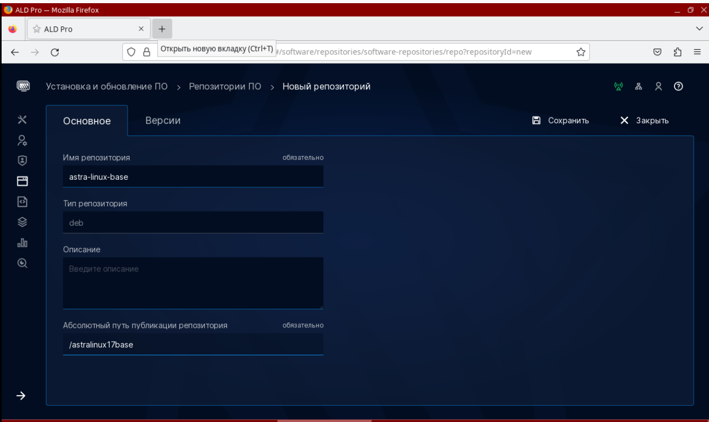
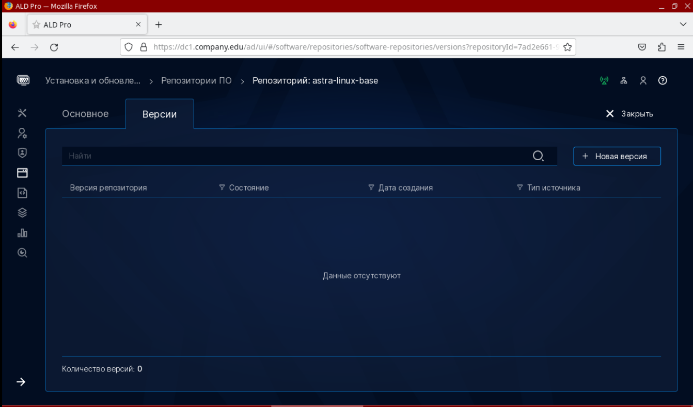
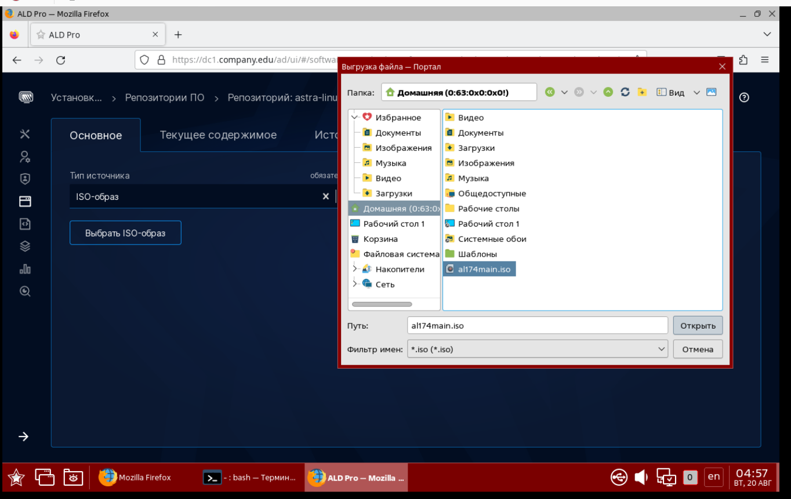

# Глава 5 "Сетевой репозиторий ALD Pro"
Цель главы
----------

1. Произвести установку сервера репозитория ALD Pro;

2. Подключить клиентские компьютеры к использованию нового домена.

# Подготовка cервера к развертыванию службы "Репозитория" 

Ровно как и в случае развертывания второго доменного контроллера вам нужно:

1. Компьютер должен получить IP-адрес - статический или динамический. 

2. Убедитесь, что клиентский компьютер корректно обрабатывает DNS-зоны  - как внутреннюю, так и локальную. В данный момент, конечно, мы не учитываем использование локального репозитория, предполагая, что у вас есть выход в интернет для использования dl.astralinux.ru.


3. Файл **/etc/apt/sources.list** или **/etc/apt/sources.list.d** настроен на работу с репозиториями: 

Для Astra Linux 1.7.4 - 

```
deb http://dl.astralinux.ru/astra/frozen/1.7_x86-64/1.7.4/repository-main 1.7_x86-64 main non-free contrib
deb http://dl.astralinux.ru/astra/frozen/1.7_x86-64/1.7.4/repository-update 1.7_x86-64 main contrib non-free
deb http://dl.astralinux.ru/astra/frozen/1.7_x86-64/1.7.4/repository-base 1.7_x86-64 main non-free contrib
deb http://dl.astralinux.ru/astra/frozen/1.7_x86-64/1.7.4/repository-extended 1.7_x86-64 main contrib non-free

deb https://download.astralinux.ru/aldpro/frozen/01/2.3.0 1.7_x86-64 main base
```

Для Astra Linux 1.7.5 - 

```
deb http://dl.astralinux.ru/astra/frozen/1.7_x86-64/1.7.5/repository-main 1.7_x86-64 main non-free contrib
deb http://dl.astralinux.ru/astra/frozen/1.7_x86-64/1.7.5/repository-update 1.7_x86-64 main contrib non-free
deb http://dl.astralinux.ru/astra/frozen/1.7_x86-64/1.7.5/repository-base 1.7_x86-64 main non-free contrib
deb http://dl.astralinux.ru/astra/frozen/1.7_x86-64/1.7.5/repository-extended 1.7_x86-64 main contrib non-free

deb https://download.astralinux.ru/aldpro/frozen/01/2.3.0 1.7_x86-64 main base
```

4. После подключения новых репозиториев, выполните обновление пакетной базы и самой операционной системы с опцией **--force-confnew** для обновления конфигруационных файлов всех служб.

```
sudo apt update
sudo apt list --upgradable
sudo apt dist-upgrade -y -o Dpkg::Options::=--force-confnew
```

5. Выполнить установку aldpro-client

```
sudo DEBIAN_FRONTEND=noninteractive apt-get install -y -q aldpro-client
```

Комментарии к использованным ключам можно найти в прошлой главе по установке пакетов на контроллере домена.

Если перезагружать пользовательский компьютер сейчас, то в сообщениях ядра можно будет увидеть ошибки запуска SSSD и зависящих от нее служб (журнал загрузки можно найти в файле **/var/log/boot.log**). 

Это происходит по причине того, что служба еще не настроена соответствующим образом (журнал службы sssd можно найти в файле **/var/log/sssd/sssd.log**).

При установке клиента в системе устанавливается более 130 зависимостей.


# Ввод компьютера в домен

Команда нам уже знакома: 

```
sudo /opt/rbta/aldpro/client/bin/aldpro-client-installer --domain company.edu --account admin --password 'P@ssw0rd' --host mon --gui --force
```

После ввода в домен не забываем перезагрузиться: 

```
sudo reboot
```


# Развертывание системы репозитория

В портале «ALD Pro» в разделе «Установка и обновление ПО --> Репозитории ПО» На вкладке «Серверы репозиториев ПО» развернуть сервер репозиториев нажав на кнопку «Новый сервер репозиториев ПО», привязав его к сайту «Головной офис».


Отслеживать процесс установки можно также через раздел "Автоматизация", или через **tail -f /var/log/salt/minion**


## Как проверить, что все хорошо?

В разделе "Сервера репозиториев" появился новый сервер


# Что дальше?

Локальный репозиторий нужен для того, чтобы выполнять обновление и установку ПО без доступа к сети Интернет. Работа с репозиториями в составе ALD Pro сводится к следующим действиям:

1. Загружаем ISO-образ с пакетной базой;

2. Публикуем его в репозиторий;

3. Подключаем клиентов.


## Шаг первый

Необходимо скачать образ ISO с базовым дистрибутивом на сайте в личном кабинете, перейдя по ссылке https://lk-new.astralinux.ru/, или 
вставить диск в привод, скопировав ISO-образ в текущую директорию командой **dd**:

```
dd if=/dev/sr0 of=al174main.iso bs=100M status=progress
```


## Шаг второй

Создать новый репозиторий для корпоративной сети, перейдя в раздел «Установка и обновление ПО — Репозитории ПО». На вкладке «Репозитории ПО» нажать на кнопку «Новый репозиторий».

Заполняем пункты меню и **Сохранить**



Раздел "Версии" теперь доступен. Переходим на вкладку и создаем новую запись.



Загрузите ISO-образ



Ожидаем загрузки диска, более того, после загрузки репозиторий также будет недоступен некоторое время, пока будет выполняться обработка на стороне репозитория


Когда все пройдет удачно, статус поменяется на "Опубликована".


## Шаг третий

Подключаем клиентов, на нашем cli1, в файле **/etc/apt/sources.list**:

```
deb [trusted=yes] https://repo.company.edu/repos/astralinux17base/ 1.7_x86-64 main contrib non-free
```

Где:
* [trusted=yes] — обозначает ,что есть доверие к этому репозиторию;

* https://repo.company.edu/repos/astralinux17base/ — полный путь до репозитория, который можно посмотреть во вкладке «Основное» выбранного репозитория. Порт 443 можно не указывать, потому что он используется для протокола https; В версии 2.1.0 была особенность, что подсистема репозитория 
получала сертификат на короткое имя по названию компьютера, например, repo вместо repo.company.edu, поэтому для использования https в этом случае требовалось указывать адрес в формате «deb [trusted=yes] https://repo/repos/astralinux17base/ ...»

* 1.7_x86-64 — кодовое имя дистрибутива, которое можно посмотреть в описании версии;

* main, contrib и non-free — Компоненты дистрибутива, которое можно посмотреть в описании версии;


Проверим, что репозиторий работает:

```
apt update
```

В результае получаем:

```
Игн:1 https://repo.company.edu/repos/astralinux17base 1.7_x86-64 
InRelease
Пол:2 https://repo.company.edu/repos/astralinux17base 1.7_x86-64 
Release [5 766 B]
Пол:3 https://repo.company.edu/repos/astralinux17base 1.7_x86-64 
Release.gpg [833 B] 
Пол:4 https://repo.company.edu/repos/astralinux17base 1.7_x86-64/main
amd64 Packages [1 310 kB]
Пол:5 https://repo.company.edu/repos/astralinux17base 
1.7_x86-64/contrib amd64 Packages [2 155 B] 
Пол:6 https://repo.company.edu/repos/astralinux17base 1.7_x86-64/non-free amd64 Packages [55,8 kB] 
```


Репозиторий доступен для просмотра через HTTP и HTTPS по пути:

```
https://repo.company.edu/repos/
```


# И что, неужели каждый раз грузить ISO? 

Нет, можно настроить автоматическое зеркалирование. Но уже без ALD Pro.

Так, если мы проанализируем конфигурационные файлы


То обнаружим, что располагается репозиторий по пути - **/opt/rbta/aldpro/repo/storage/link_root_folder**.

А значит, мы можем настроить обычный apt-mirror  в этот каталог

На сервере репозитория выполните команду:

```
apt install apt-mirror -y
```

Перейдем в конфигурационный файл **/etc/apt/mirror.list**.


Необходимо исправить параметр **set base_path**, для того чтобы указать каталог синхронизации. 

После конструкции **##### end config ######** укажите репозиторий для зеркалирования. Можно несколько.

Запустить процесс зеркалирования можно командой:

```
apt-mirror
```

После завершения, создайте символьную ссылку для удобства, например:

```
ln -s /opt/rbta/aldpro/repo/storage/mirror/download.astralinux.ru/astra/stable/1.7_x86-64/repository-main /opt/rbta/aldpro/repo/storage/link_root_folder/repository-main
```

Таким образом, репозиторий через браузер выглядит так:


А на клиенте подключается так:


## А как автоматизировать?

Например, через crontab, в файле **/etc/crontab** 


Настройка выше настроит автоматическую синхронизацию в 4 утра каждый день. 

Или через systemd-timers. [Ссылка](https://github.com/qqga1337/astra-linux/blob/main/Lab_7/Lab_7.md)

# Публикация DEB-пакета не из репозитория Astra Linux

Предположим, вы хотите опубликовать DEB-пакет, которого нет в репозиториях. Например, Яндекс.Браузер. Скачаем его командой:

```
wget https://download.yandex.ru/browser/astra-os/yandex-browser.deb
```

Далее, для КАЖДОГО нового пакета вам придется создать новый репозиторий. В нашем случае, предположим, что его название будет - **yandex-browser-corp**


После создания репозитория, публикуем новую версию. Перейдите на вкладку "Версия". 


Настройте поля меню публикации версии в соотвествии с таблицей:

| Поле | Значение | Описание 
| ----| -------- | -------- 
| Источник | yandex | Справочное поле для описания источника пакета |  
| Метка | browser | Справочное поле для описания вида программы |  
| Номер версии | 1 | Целое число для контроля версии репозитория. При обновлении увеличиваем на единицу |  
| Кодовое имя дистрибутива | latest | Используется для возможности размещения в одном репозитории нескольких дистрибутивов, но репозиторий «ALD Pro» позволяет разместить только один дистрибутив, поэтому не имеет практического значения, используем значение latest. |  
| Архитектура | amd64 | Архитектура ПО |  
| Компоненты дистрибутива | main | Используется для возможности распределения пакетов по категориям. В репозиторий ALD Pro есть только категория **main**|  

Загружаем новый пакет на вкладке "Версии"


После загрузки и обработки нажмите "Опубликовать"


 
### Примечание автора
В текущей реализации подсистемы репозиториев действие «Опубликовать» нельзя отменить, поэтому для обновления приложения нужно будет создать новую версию репозитория.


Проверим, что репозиторий появился: 


Подключить клиента к нему можно, путем редактирования файла **/etc/apt/sources.list**. Добавьте строчку: 


```
deb [trusted=yes] https://repo.company.edu/repos/yandexbrowser/ latest main
```


Установить Яндекс командой:

```
apt install yandex-browser-stable -y
```

Рабочий Яндекс.Браузер


# Как же сложно! А если у меня много будет ПО, каждый раз делать новый репозиторий? 

На данный момент реализация работы с репозиториями крайне неудобная, проще использовать обычный reprepro, в обход портала управления ALD Pro. И у Astra Linux Wiki есть отличная статья о том, как это делать [Ссылка](https://wiki.astralinux.ru/pages/viewpage.action?pageId=3277393)

Это позволит создать единый репозиторий со всеми пакетами сразу, а не текущий формат ALD Pro по формуле:

```
1 программа = 1 репозиторий
```


# Дополнительная информация:
1) Создание собственного репозитория [Ссылка](https://wiki.astralinux.ru/pages/viewpage.action?pageId=3277393)
2) Debian - архитектура репозитория [Ссылка](https://wiki.debian.org/DebianRepository/SetupWithReprepro)
3) Aptly - как альтернативное решение (сложно!) [Ссылка](https://www.aptly.info/)
