# Глава 6 "DHCP, TFTP+PXE в ALD Pro"
Цель главы
----------

1. Произвести установку сервера DHCP;

2. Произвести установку сервера TFTP + PXE;

3. Выполнить установку ОС по сети.

# Подготовка cервера к развертыванию службы "Репозитория" 

Ровно как и в случае развертывания второго доменного контроллера вам нужно:

1. Компьютер должен получить IP-адрес - статический или динамический. 

2. Убедитесь, что клиентский компьютер корректно обрабатывает DNS-зоны  - как внутреннюю, так и локальную. В данный момент, конечно, мы не учитываем использование локального репозитория, предполагая, что у вас есть выход в интернет для использования dl.astralinux.ru.

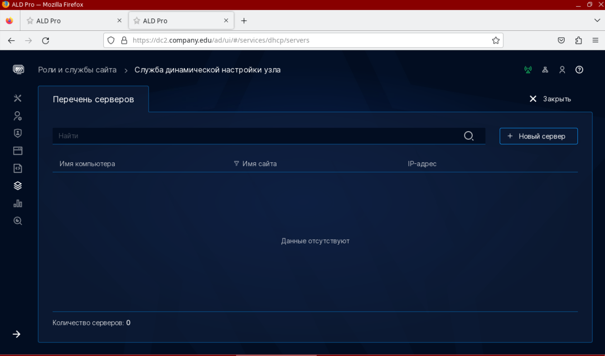

3. Файл **/etc/apt/sources.list** или **/etc/apt/sources.list.d** настроен на работу с репозиториями: 

Для Astra Linux 1.7.4 - 

```
deb http://dl.astralinux.ru/astra/frozen/1.7_x86-64/1.7.4/repository-main 1.7_x86-64 main non-free contrib
deb http://dl.astralinux.ru/astra/frozen/1.7_x86-64/1.7.4/repository-update 1.7_x86-64 main contrib non-free
deb http://dl.astralinux.ru/astra/frozen/1.7_x86-64/1.7.4/repository-base 1.7_x86-64 main non-free contrib
deb http://dl.astralinux.ru/astra/frozen/1.7_x86-64/1.7.4/repository-extended 1.7_x86-64 main contrib non-free

deb https://download.astralinux.ru/aldpro/frozen/01/2.3.0 1.7_x86-64 main base
```

Для Astra Linux 1.7.5 - 

```
deb http://dl.astralinux.ru/astra/frozen/1.7_x86-64/1.7.5/repository-main 1.7_x86-64 main non-free contrib
deb http://dl.astralinux.ru/astra/frozen/1.7_x86-64/1.7.5/repository-update 1.7_x86-64 main contrib non-free
deb http://dl.astralinux.ru/astra/frozen/1.7_x86-64/1.7.5/repository-base 1.7_x86-64 main non-free contrib
deb http://dl.astralinux.ru/astra/frozen/1.7_x86-64/1.7.5/repository-extended 1.7_x86-64 main contrib non-free

deb https://download.astralinux.ru/aldpro/frozen/01/2.3.0 1.7_x86-64 main base
```

4. После подключения новых репозиториев, выполните обновление пакетной базы и самой операционной системы с опцией **--force-confnew** для обновления конфигруационных файлов всех служб.

```
sudo apt update
sudo apt list --upgradable
sudo apt dist-upgrade -y -o Dpkg::Options::=--force-confnew
```

5. Выполнить установку aldpro-client

```
sudo DEBIAN_FRONTEND=noninteractive apt-get install -y -q aldpro-client
```

Комментарии к использованным ключам можно найти в прошлой главе по установке пакетов на контроллере домена.

Если перезагружать пользовательский компьютер сейчас, то в сообщениях ядра можно будет увидеть ошибки запуска SSSD и зависящих от нее служб (журнал загрузки можно найти в файле **/var/log/boot.log**). 

Это происходит по причине того, что служба еще не настроена соответствующим образом (журнал службы sssd можно найти в файле **/var/log/sssd/sssd.log**).

При установке клиента в системе устанавливается более 130 зависимостей.


# Ввод компьютера в домен

Команда нам уже знакома: 

```
sudo /opt/rbta/aldpro/client/bin/aldpro-client-installer --domain company.edu --account admin --password 'P@ssw0rd' --host mon --gui --force
```

После ввода в домен не забываем перезагрузиться: 

```
sudo reboot
```


# Развертывание системы DHCP

Подготовьте сервер, также, как и все предыдущие.

В портале «ALD Pro» в разделе Роли и службы сайта > Служба динамической настройки узла». Разверните сервер нажав на кнопку «Новый сервер».


Заполним информацию о сервере

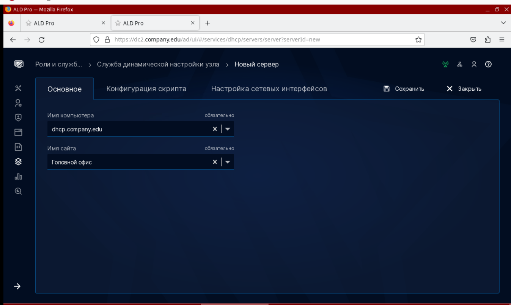

Традиционно, через систему "Автоматизации" мы можем контроллировать установку DHCP

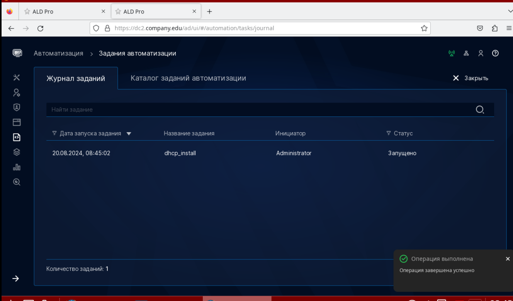

После установки службы DHCP, вы можете редактировать файлы конфигурации через веб-интерфейс

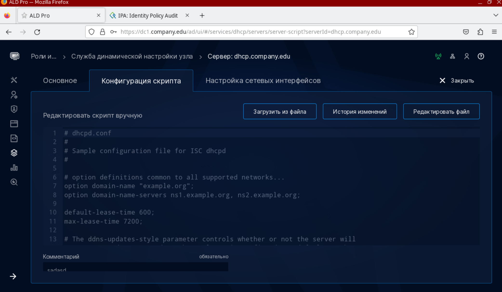

Но рекомендуется редактировать файлы напрямую на сервере - **/etc/dhcp/dhcpd.conf** и **/etc/default/isc-dhcp-server**.

## Что в DHCP надо сделать? 

В файле **/etc/dhcp/dhcpd.conf**

Привести секцию subnet к следующему виду:

```
subnet 192.168.122.0 netmask 255.255.255.0 {
    range 192.168.122.50 192.168.122.60;
    option domain-name-servers 192.168.122.100,192.168.122.200;
    option domain-name "company.edu";
    option routers 192.168.122.1;
    filename "pxelinux.0"
    next-server 192.168.122.220;
}
```

# Настройки выполняемые ниже, прозходят в обход ALD Pro. И будут актуальны, если PXE сервер планируется настраивать отдельно. Вне программного комплекса ALD Pro.

## Далее на TFTP-server. Скопируем установочный диск, который мы уже подготовили в главе про сетевой репозиторий

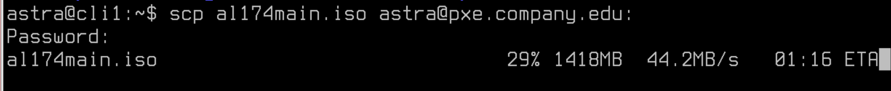

А после, смонтируем его в каталог - **/var/www/html/astra**

Команды:
```
cd /var/www/html
rm -rf index.html
mount /home/astra/al174main.iso /var/www/html/astra
```

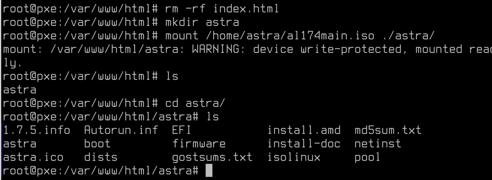


Далее, обратимся к статье на форуме ALD Pro [Ссылка](https://ald-pro.com/threads/ustanovka-os-po-seti-1-4-0.57/)

Самый интересующий нас сейчас файл из приложенного к статье архива - **preseed_stable.cfg**

### Что это такое? 

Файл preseed_stable.cfg обычно используется в процессе автоматической установки операционных систем на базе Debian и Ubuntu. Preseed-файл позволяет автоматизировать установку, предоставляя ответы на вопросы, которые обычно задаются в интерактивном режиме. Таким образом, он упрощает массовое развертывание систем и их преднастройку.

В подобном конфигурационном файле могут содержаться такие параметры, как:

1. Выбор языка и часового пояса.
2. Настройки разметки диска и файловых систем.
3. Конфигурация сети.
4. Установка определённых пакетов программного обеспечения.
5. Настройка пользователей и их паролей.

Указанный выше конфигурационный файл должен располагаться в каталоге - **/var/www/html** под именем - preseed.cfg

В предложенном файле на форуме уже сделано много правок, мы прокомментируем только то, что изменили: 

1. Подключаем Интернет-репозиторий 1.7 для настройки, комментируем локальные

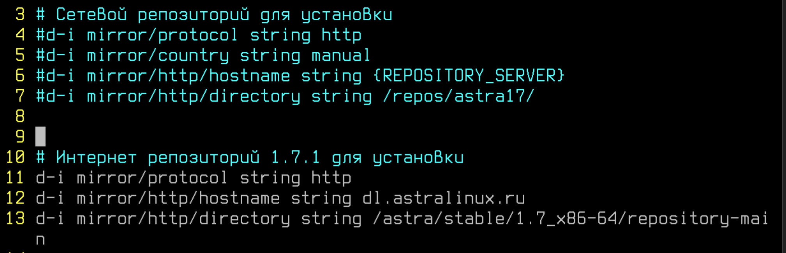

2. В разделе **Выбор ПО для установки** можно указать то ПО, что вам потребуется. Мы оставим все обычное.

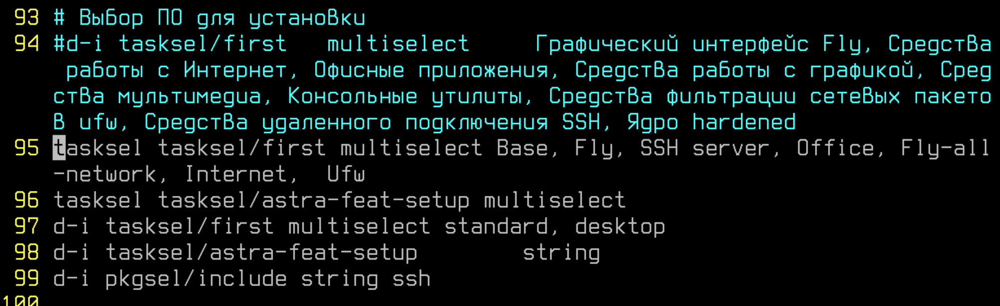

3. В уровне защищенности укажем "Воронеж"

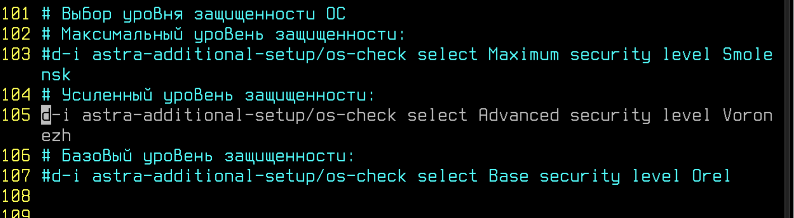

4. Настраиваем усиленный уровень защищенности

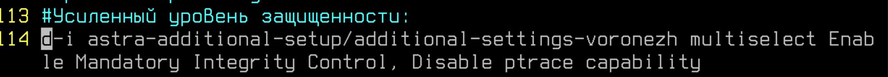

5. Укажем логин и пароль для локального пользователя

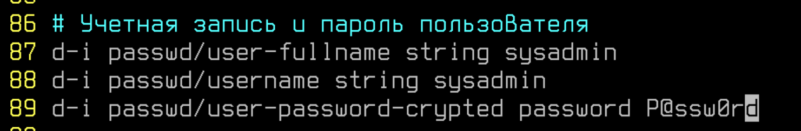

6. И так же пароль на GRUB


### Пароли в открытом виде! Это неправильно!

Да, поэтому делаем так!

Чтобы зашифровать пароль используйте: 

```
mkpasswd -m sha-512
```

Итоговый хэш можно использовать в конструкции пароля:

```
d-i  passwd/user-password-crypted password $6$ONFMFMFFWEF
```

А для GRUB команда: 

```
grub-mkpasswd-pbkdf2
```

Использование аналогично, добавьте в строку в preseed.cfg:

```
d-i grub-installer/password-crypted  password grub.pbkdf2.sha512.10000.AEB46DEA76182E7E27C1D
```

# Файл настроили, что дальше?

Переходим в каталог - **/srv/tftp**

И копируем папку **netinst** из подключенного ранее диска каталога **/var/www/html/astra**

```
cp -r /var/www/html/astra/netinst/* ./
```

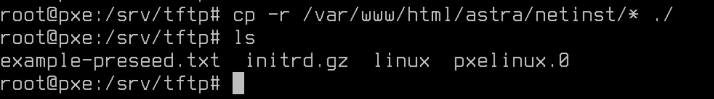

Также, потребуется скачать библиотеку с каталога **/var/www/html/astra/isolinux/ldlinux.c32**

```
cp -r /var/www/html/astra/isolinux/ldlinux.c32 /srv/tftp/
```

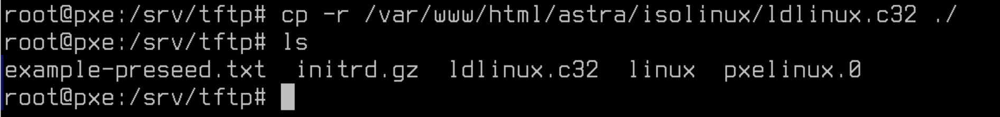

Файл example-preseed.txt лучше удалить. Итоговый каталог **/srv/tftpd** выглядит так:

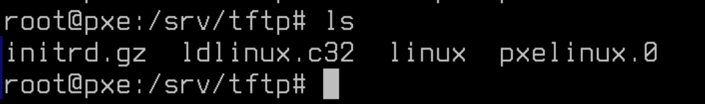

## Все? Можем ставить компьютеры?!

Еще нет!

Создаем в /srv/tftp папку - **pxelinux.cfg**

```
mkdir pxelinux.cfg
```

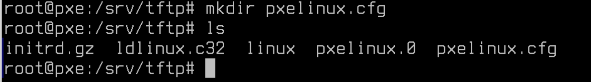

В указанном каталоге создаем файл - **default**.

```
DEFAULT astra
LABEL astra
kernel linux
append initrd=initrd.gz auto=true priority=critical hostname=Clien1 domain=company.edu astra-license/license=true url=http://192.168.122.220/preseed.cfg interface=auto netcfg/dhcp_timeout=60
```

Давайте разберем каждый параметр в указанной конфигурации:

1. **DEFAULT astra**: 
   - Указывает на то, что по умолчанию будет загружаться конфигурация с меткой "astra". Это полезно в загрузочных меню, которые могут содержать несколько вариантов загрузки.

2. **LABEL astra**: 
   - Определяет метку для загрузочной записи. Эта метка может отображаться в меню загрузки и используется для идентификации конкретной конфигурации.

3. **kernel linux**:
   - Указывает, какой ядро (или ядро ОС) будет использоваться для загрузки. Обычно это указывает на местоположение ядра в файловой системе загрузочного носителя.

4. **append initrd=initrd.gz auto=true priority=critical hostname=Clien1 domain=company.edu astra-license/license=true url=http://192.168.122.220/preseed.cfg interface=auto netcfg/dhcp_timeout=60**:
   - `initrd=initrd.gz`: Задает использование определенного файла initrd (initial ramdisk), который загружается в память и используется ядром для выполнения начальной загрузки.
   - `auto=true`: Указывает, что установка должна проходить в автоматическом режиме.
   - `priority=critical`: Устанавливает уровень важности сообщений. В данном случае, система будет запрашивать только самые важные параметры, что минимизирует количество вопросов, задаваемых в процессе установки.
   - `hostname=Clien1`: Задает имя хоста для устанавливаемой системы.
   - `domain=company.edu`: Устанавливает доменное имя для системы.
   - `astra-license/license=true`: Вероятно, это пользовательский параметр, специфичный для дистрибутива "Astra", который указывает на принятие лицензионного соглашения.
   - `url=http://192.168.122.220/preseed.cfg`: Определяет URL-адрес, откуда будет загружен preseed-файл с ответами для автоматической установки.
   - `interface=auto`: Указание интерфейса сети, который должен быть настроен автоматически (обычно выбирается первый доступный интерфейс).
   - `netcfg/dhcp_timeout=60`: Устанавливает время ожидания в секундах для получения ответа от DHCP-сервера.

Эти настройки используются для автоматизации и минимизации вмешательства человека в процесс установки операционной системы.


# Можем проверять!

Включим компьютер клиента и загрузимся через сетевую карту

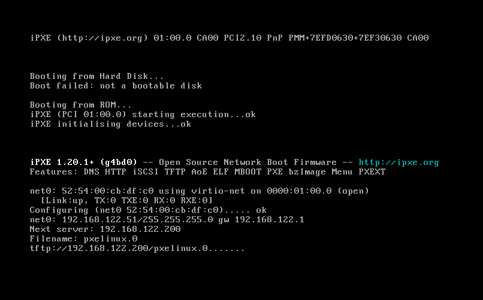

Запускается установщик ОС


# А если все же через ALD Pro? 

Заполняем все файлы из архива в параметры меню ALD Pro

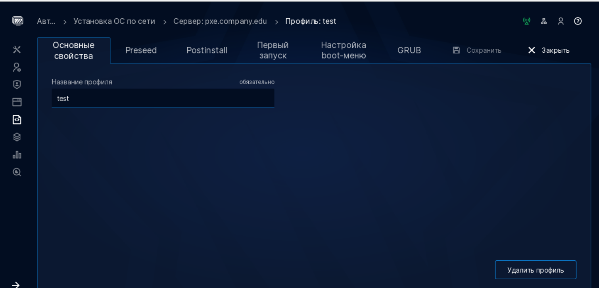

Что нужно поменять? 

1. В файле preseed:
    * Меняем репозиторий на свой, или интернет;
    * Меняем пароли на свои и шифруем их;
    * Устанавливаемое ПО, по желанию.

2. В postinstall, только параметры нашего сервера: 


3. В "Первый запуск" мы меняем только "шапку" документа.

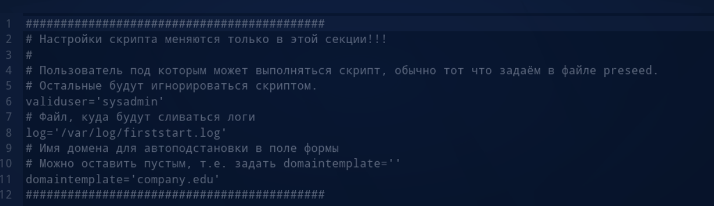

4. Настройка boot-меню:

Во всех строчках, где указывается сервер - укажите свой PXE. На строке 38, обязательно поменяйте пароль на свой, а то не получится зайти в PXE процесс

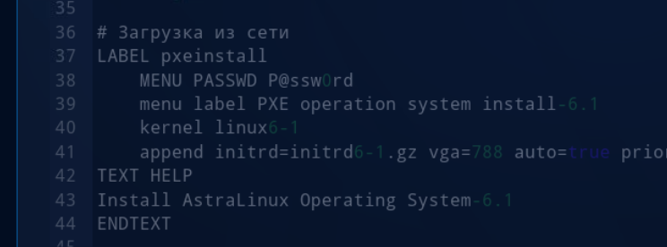

5. В GRUB - также меняем пароли и сервер PXE.

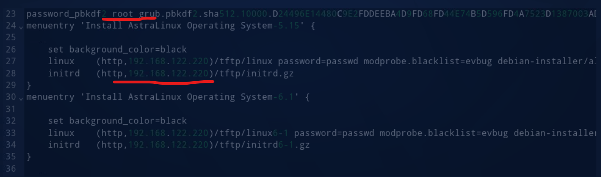

## И как установилось?

Прекрасно!

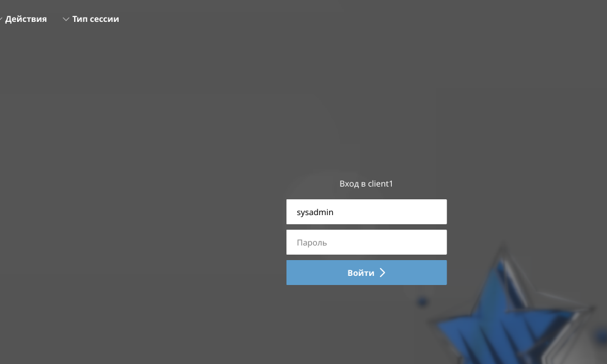

# Дополнительная информация:
1) ALD Pro - установка по сети [Ссылка](https://ald-pro.com/threads/ustanovka-os-po-seti-1-4-0.57/)
2) Установка по сети без ALD Pro [Ссылка](https://www.youtube.com/watch?v=7utIfITysGA)
3) Установка ОС по сети - гайд от Astra Linux [Ссылка](https://wiki.astralinux.ru/pages/viewpage.action?pageId=68914051)
